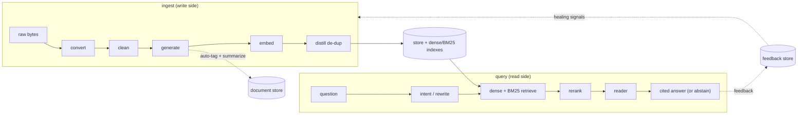

# SparkSage

[](https://pypi.org/project/sparksage/)
[](#license)
[](#development)
[](https://pypi.org/project/sparksage/)
[](README_CN.md)

**Structured, question-aligned knowledge chunks for high-quality RAG.**

SparkSage replaces naive fixed-size text slicing with the **IdeaBlock** — a
small, self-contained *knowledge unit* that is aligned to how users ask
questions. Instead of embedding arbitrary text fragments (which get cut
mid-sentence and retrieve poorly), SparkSage embeds whole, verified answers.

It is an **end-to-end question-answering core**: from raw bytes to a
retrievable, de-duplicated corpus, all the way to a grounded, cited answer.
Every stage is a swappable protocol with a pure-stdlib default, so the core
runs fully offline and is unit-testable with deterministic fakes — install
only the extras you actually need.

## Installation

```bash
pip install sparksage                  # core only (schema + stdlib defaults)
pip install 'sparksage[llm,embed]'     # + generation + embedding (OpenAI SDK)
pip install 'sparksage[convert]'       # + any-file -> Markdown (markitdown)
pip install 'sparksage[api]'           # + WEB API (FastAPI + uvicorn)
pip install 'sparksage[distill]'       # + de-dup acceleration + FaissVectorStore
pip install 'sparksage[chroma]'        # + ChromaVectorStore
pip install 'sparksage[pgvector]'      # + PgvectorVectorStore (Postgres)
pip install 'sparksage[rerank]'        # + cross-encoder re-ranking
pip install 'sparksage[all]'           # everything above + CJK (jieba)
```

> Each subsystem lazily imports its own SDK inside the backend that needs it,
> so the core stays zero-dependency — install only the extras you use.

## The SparkSage pipeline

One line runs it all — `bytes → convert → clean → generate → embed → distill`
on the ingest side, and `question → intent → retrieve → answer` on the query
side, with a feedback loop that turns user verdicts back into ingest actions:



---

## Why question-aligned chunks?

Traditional `RecursiveCharacterTextSplitter` chunks:

- get cut mid-sentence → semantic breakage,
- carry no notion of *what question they answer* → sparse vector clusters,
- lack queryable metadata → weak filtering / hybrid retrieval.

An IdeaBlock fixes all three at the data layer — and the dividend compounds
across every downstream stage:

| Stage | Naive `RecursiveCharacterTextSplitter` | IdeaBlock |
| --- | --- | --- |
| Splitting | cut mid-sentence → semantic breakage | whole, verified `trusted_answer` per block |
| Generation | no notion of *what question it answers* | every block carries its `critical_question` |
| Retrieval | weak metadata, sparse vector clusters | `tags` / `entities` / `keywords` filter + boost |
| Answers | fragments re-mixed, easy to hallucinate | QA-aligned context + `source.locator` citations |

---

## The IdeaBlock schema

```xml
<ideablock>
  <name>标题 / short title</name>
  <critical_question>the single question this block answers?</critical_question>
  <trusted_answer>verified, self-consistent answer (2–3 sentences, ≤500 chars)</trusted_answer>
  <tags>IMPORTANT, TECHNOLOGY, ...</tags>
  <entity><entity_name>..</entity_name><entity_type>PRODUCT|..</entity_type></entity>
  <keywords>keywords for BM25 / lexical recall</keywords>
</ideablock>
```

The same shape as a Python dict (the `to_xml()` / `from_xml()` round-trip is
lossless):

```python
{
    "name": "标题 / short title",
    "critical_question": "the single question this block answers?",
    "trusted_answer": "verified, self-consistent answer (2–3 sentences, ≤500 chars)",
    "tags": ["IMPORTANT", "TECHNOLOGY"],
    "entities": [{"entity_name": "..", "entity_type": "PRODUCT"}],
    "keywords": ["keywords", "for BM25", "lexical recall"],
}
```

Core model: [`src/sparksage/schema/ideablock.py`](src/sparksage/schema/ideablock.py).

### Design principles

- **Question–answer alignment** — `critical_question` + `trusted_answer` align
  the chunk to the query manifold, so dense vectors cluster tightly around
  user intent.
- **Single-field embedding** — only `trusted_answer` is embedded by default,
  killing the "splitter cut my sentence in half" problem. See
  [`embedding_text`](src/sparksage/schema/ideablock.py).
- **Rich, queryable metadata** — `tags` / `entities` / `keywords` power
  filtering, permission scoping and hybrid (BM25 + dense) retrieval.
- **Provenance & lifecycle** — every block knows its source
  ([`SourceRef`](src/sparksage/schema/source.py)) and dedup state
  (`status` / `parents`), so the corpus is auditable and the Distill pipeline
  can merge safely.

### TechnicalBlock (ordered content variant)

For manuals / SOPs / runbooks where *sequence is meaning*, the
[`TechnicalBlock`](src/sparksage/schema/technical.py) layers in:

- **ordered, role-tagged sentences** (`INFO` / `COMMAND` / `WARNING` /
  `PREREQUISITE` / `REFERENCE` / `RESULT`), and
- **Primary / Proceeding / Following** context windows.

It inherits the full IdeaBlock core, so it interoperates with the same
retrieval stack.

---

## Quick start

```bash
pip install -e ".[dev]"

python3 - <<'PY'
from sparksage.schema import IdeaBlock, Tag, Entity, EntityType, BlockStatus

block = IdeaBlock(
    name="What SparkSage does",
    critical_question="What problem does SparkSage solve?",
    trusted_answer=(
        "SparkSage turns documents into question-aligned knowledge units so "
        "retrieval hits whole, self-contained answers instead of text shards."
    ),
    tags=[Tag.IMPORTANT, Tag.TECHNOLOGY],
    entities=[Entity(entity_name="SparkSage", entity_type=EntityType.PRODUCT)],
    keywords=["rag", "chunking"],
    status=BlockStatus.ACTIVE,
)
print(block.embedding_text)
print(block.to_xml())
PY
```

A fuller end-to-end demo:

```bash
PYTHONPATH=src python3 examples/build_chunks.py
```

### Example index

Every example runs **fully offline** (deterministic fakes — no API key, no
`markitdown`) unless noted.

| Example | Demonstrates |
| --- | --- |
| [`build_chunks.py`](examples/build_chunks.py) | The IdeaBlock + TechnicalBlock schema end-to-end |
| [`generate_blocks.py`](examples/generate_blocks.py) | Free text → many IdeaBlocks via an LLM client |
| [`convert_files.py`](examples/convert_files.py) | Any file → Markdown (single + batch directory) |
| [`clean_text.py`](examples/clean_text.py) | convert → clean → generate (source-aware rules) |
| [`search_blocks.py`](examples/search_blocks.py) | embed → index → kNN search → JSON persist → reload |
| [`distill_blocks.py`](examples/distill_blocks.py) | Near-duplicate de-dup pipeline (cluster → merge) |
| [`extract_tags.py`](examples/extract_tags.py) | RAKE / TF-IDF / TextRank auto-tagging (CJK-aware) |
| [`manage_documents.py`](examples/manage_documents.py) | Document CRUD + tag vocabulary (in-memory / SQLite) |
| [`process_query.py`](examples/process_query.py) | Query → intent classification → rewrite (multi-turn) |
| [`run_benchmark.py`](examples/run_benchmark.py) | IdeaBlock vs naive chunking → HTML report |
| [`serve_api.py`](examples/serve_api.py) | FastAPI server: `/convert` + `/generate` via TestClient |
| [`qa_full_pipeline.py`](examples/qa_full_pipeline.py) | Full knowledge-QA: ingest → retrieve → answer + feedback |

---

## Generate IdeaBlocks from text

SparkSage decomposes a passage of free text into several question-aligned
IdeaBlocks via an LLM. The generation core depends on a small
[`LLMClient`](src/sparksage/generator/client.py) protocol, so it works with any
OpenAI-compatible endpoint (OpenAI, Azure, vLLM, Ollama, GLM, ...) and is fully
testable offline with a deterministic fake.

```bash
pip install 'sparksage[llm]'   # pulls the optional 'openai' SDK
```

```python
from sparksage import IdeaBlockGenerator, OpenAICompatibleClient

client = OpenAICompatibleClient(api_key="...", model="gpt-4o-mini")
gen = IdeaBlockGenerator(client)

blocks = gen.generate(
    "SparkSage replaces naive text slicing with question-aligned chunks ...",
    source_uri="file://docs/overview.md",
)
for b in blocks:
    print(b.critical_question, "->", b.trusted_answer)
```

How it stays robust and schema-safe:

- The prompt teaches the model the IdeaBlock format and the **live controlled
  vocabularies** (`Tag` / `EntityType`) read straight from the enum definitions,
  so it can never drift from the code.
- Model output is parsed into [lenient intermediate
  models](src/sparksage/generator/schema.py), then **coerced** through the
  vocabularies into strict `IdeaBlock`s. Unknown tags are dropped; the
  `critical_question` is repaired to end with `?`; oversized answers are skipped
  (split into more blocks instead of truncating).
- `strict=True` fails fast on the first malformed block; the default skips bad
  blocks and reports them via `generate_with_stats()`.
- Provenance (`source_uri`) is attached to every emitted block.

Offline demo (no API key):

```bash
PYTHONPATH=src python3 examples/generate_blocks.py
```

---

## Convert any file to Markdown

Before chunking, source documents come in many formats. SparkSage normalizes them
all to Markdown (the lingua franca downstream generation expects) via a pluggable
backend built on Microsoft
[`markitdown`](https://github.com/microsoft/markitdown) — PDF, Word, PowerPoint,
Excel, HTML, CSV/JSON/XML, images (EXIF + OCR), audio (transcription), EPub, ZIP
archives and more.

```bash
pip install 'sparksage[convert]'   # pulls markitdown[all]
```

```python
from sparksage import MarkdownConverter

conv = MarkdownConverter()

# single file -> Markdown
result = conv.convert("report.pdf")
print(result.markdown)

# whole directory tree -> .md files
conv.convert_directory("docs/", dest_dir="docs_md/")
```

The returned [`ConversionResult`](src/sparksage/convert/converter.py) chains
straight into generation:

```python
blocks = IdeaBlockGenerator(client).generate(
    result.markdown, source=result.source_ref,
)
```

How it stays robust and dependency-light:

- The conversion core depends only on a small
  [`ConverterBackend`](src/sparksage/convert/backend.py) protocol, so it is fully
  unit-testable offline with a deterministic fake — `markitdown` is imported
  lazily and only when no backend is injected.
- Batch conversion is **resilient**: a single bad file is logged and skipped
  rather than aborting the whole run.
- `convert_directory` filters by a sensible
  [`DEFAULT_EXTENSIONS`](src/sparksage/convert/converter.py) set (overridable)
  and recurses by default; `convert_to_file` writes `<name>.md` for each source.

Offline demo (no `markitdown` needed):

```bash
PYTHONPATH=src python3 examples/convert_files.py
```

---

## Clean document text

Conversion yields *raw* Markdown faithful to the source bytes — but that text is
seldom generation-ready: BOMs, mixed line endings, leaked control characters,
page headers/footers, watermarks, boilerplate, PII. **Which of those are noise
depends on your business**, so cleaning is built to be customized.

[`TextCleaner`](src/sparksage/clean/cleaner.py) applies a pipeline of tiny,
composable rules. Rules can be **global** (every document) or
**source/filename-specific** (PDF footers only, Confluence macros only, ...):

```python
from sparksage import TextCleaner, RegexReplaceRule

cleaner = TextCleaner()                                     # sensible defaults
cleaner.add(RegexReplaceRule(r"CONFIDENTIAL", ""))          # every document
cleaner.add(RegexReplaceRule(r"\b\d{3}-\d{2}-\d{4}\b", "[REDACTED]"))  # PII
cleaner.add_for("*.pdf", RegexReplaceRule(r"Page \d+ of \d+", ""))     # PDF footers only

cleaned = cleaner.clean(raw_text, source="docs/report.pdf")
# or chain straight off a ConversionResult:
cleaned = cleaner.clean_result(conv_result)

blocks = IdeaBlockGenerator(client).generate(
    cleaned.text, source=cleaned.source_ref,
)
```

Built-in rules cover the normalization that helps almost every document
(`RemoveBomRule`, `NormalizeLineEndingsRule`, `RemoveControlCharsRule`,
`StripTrailingWhitespaceRule`, `CollapseBlankLinesRule`, `RemoveHtmlCommentsRule`).
Two escape hatches cover business-specific surgery without writing a class:

- [`RegexReplaceRule`](src/sparksage/clean/rules.py) — pattern-based
  remove/replace (watermarks, footers, redaction, terminology normalization).
- [`CallableRule`](src/sparksage/clean/rules.py) — wrap any
  `(text, source) -> text` function.

For full control, implement the
[`CleaningRule`](src/sparksage/clean/rules.py) protocol (a single `clean` method)
and register it. Source routing lives in the
[`CleaningRegistry`](src/sparksage/clean/registry.py), which matches by glob
(against both path and basename) or regex.

How it stays robust:

- The cleaning core depends only on the `CleaningRule` protocol and the
  `CleaningRegistry` dispatcher — pure Python, no external dependencies, fully
  unit-testable offline.
- `DEFAULT_RULES` run first (normalize bytes before business logic); custom rules
  layer on top in registration order. Pass `use_defaults=False` for total control.

Offline demo (convert -> clean -> generate, no API key, no `markitdown`):

```bash
PYTHONPATH=src python3 examples/clean_text.py
```

---

## Embed & retrieve IdeaBlocks

Once you have IdeaBlocks, vectorize them and search by similarity. Only
[`embedding_text`](src/sparksage/schema/ideablock.py) (name + question + answer)
is ever embedded, so a whole, verified answer is what gets matched.

```bash
pip install 'sparksage[embed]'   # pulls the optional 'openai' SDK
```

```python
from sparksage import (
    BlockEmbedder,
    InMemoryVectorStore,
    OpenAIEmbeddingClient,
)

client = OpenAIEmbeddingClient(api_key="...", model="text-embedding-3-small")
embedder = BlockEmbedder(client)

# vectors_for() returns {block_id: vector} WITHOUT mutating the blocks
# (keeps large corpora memory-light and vectors off the objects).
vectors = embedder.vectors_for(blocks)

store = InMemoryVectorStore(dimension=client.dimension)
store.add_many(vectors)

# embed a free-text query, then kNN-search the store
query_vec = embedder.embed_texts(["how do I deploy sparksage?"])[0]
for hit in store.search(query_vec, k=5):
    print(hit.score, hit.block_id)
```

The store is **text-agnostic**: it indexes vectors keyed by an opaque
`block_id` string and computes pure dot products (cosine, since every client
L2-normalizes). Embedding a query is one `embed_texts` call — retrieval stays
decoupled from embedding, exactly like the generator is decoupled from the LLM
client.

How it stays dependency-light and pluggable:

- The retrieval core depends only on the small
  [`VectorStore`](src/sparksage/embed/store.py) Protocol (`dimension` / `add` /
  `search`), so it is fully unit-testable offline with
  [`FakeEmbeddingClient`](src/sparksage/embed/client.py). The brute-force
  [`InMemoryVectorStore`](src/sparksage/embed/store.py) is pure stdlib (no
  `numpy` / `faiss`). Production backends in
  [`embed/backends/`](src/sparksage/embed/backends/) each lazily import their own
  SDK so the core stays zero-dependency — install only what you need:
  [`FaissVectorStore`](src/sparksage/embed/backends/faiss_store.py) (exact
  inner-product index, `[distill]` extra),
  [`ChromaVectorStore`](src/sparksage/embed/backends/chroma_store.py) (`[chroma]`)
  and [`PgvectorVectorStore`](src/sparksage/embed/backends/pgvector_store.py)
  (`[pgvector]`, Supabase/Postgres). All three assume L2-normalized vectors and
  return scores directly comparable to `InMemoryVectorStore.search`.
- Vectors are stored by value (copied on add), so callers can't corrupt the
  index. `search` returns [`SearchHit`](src/sparksage/embed/store.py)s sorted
  best-first.
- [`save_store`](src/sparksage/embed/persist.py) / [`load_store`](src/sparksage/embed/persist.py)
  persist a store to a **zero-dependency JSON** file so embeddings survive
  restarts; the loader validates the format marker + version and fails fast on
  corrupt / foreign files rather than guessing.

```python
from sparksage import save_store, load_store

save_store(store, "corpus.json")     # embeddings to disk
store = load_store("corpus.json")    # reload next run (same VectorStore)
```

### Find near-duplicate blocks

The store answers "what's most similar to *this query*?" — but Distill also
needs "which blocks are duplicates of *each other*?". That is the all-pairs
counterpart:

```python
from sparksage import find_similar_pairs

# vectors is the same {block_id: vector} dict from vectors_for() above
for pair in find_similar_pairs(vectors, threshold=0.6):
    print(f"{pair.score:.3f}  {pair.a} ~ {pair.b}")
```

`find_similar_pairs` is pure stdlib (`O(n²·d)`, fine for thousands of blocks),
returns each unordered pair once (`a <= b`), sorted by score then by id for
determinism. It is the first dependency-free step of the Distill de-dup
pipeline; approximate LSH + FAISS candidate reduction takes over at
million-vector scale under the `[distill]` extra.

Offline demo (embed -> index -> search -> persist -> reload, no API key):

```bash
PYTHONPATH=src python3 examples/search_blocks.py
```

---

## De-duplicate with Distill

Once a corpus is embedded, near-duplicates creep in -- the same fact re-stated
across documents, slight rewordings of one answer, a copy-pasted procedure.
**Distill** collapses them into a smaller set of canonical, more complete
IdeaBlocks. It is built on the existing building blocks rather than new ones:

- candidate detection reuses `find_similar_pairs`;
- clustering is a protocol with a pure-stdlib default (union-find connected
  components) and an optional Louvain backend under `[distill]`;
- the merge step reuses the existing `LLMClient` protocol;
- lifecycle write-back uses the schema fields that already exist for this
  purpose -- `status` / `parents` / `confidence`.

```python
from sparksage import BlockEmbedder, OpenAIEmbeddingClient, OpenAICompatibleClient
from sparksage.distill import DistillPipeline, BlockMerger

embedder = BlockEmbedder(OpenAIEmbeddingClient(api_key="..."))
merger = BlockMerger(OpenAICompatibleClient(api_key="...", model="gpt-4o-mini"))
pipe = DistillPipeline(embedder=embedder, merger=merger)

result = pipe.run(blocks)
print(f"{len(blocks)} -> {len(result.survivors)} blocks ({result.reduction:.1%} dedup)")

# result.survivors   -> canonical merged + untouched singletons, all ACTIVE
# result.merged_out  -> folded blocks, status=MERGED (kept for audit/rollback)
# result.stats       -> per-iteration diagnostics (threshold, pairs, clusters)
```

The pipeline runs **iterative threshold refinement**: start permissive (default
`0.55`), merge the obvious duplicates, re-embed the canonical blocks, then
tighten by `+0.01`/round (cap `0.98`, ~4 rounds). This collapses *chains* of
near-duplicates a single pass would miss, while never merging below the
tightened bar. Clusters larger than the per-call budget (default 20) are
**hierarchically partitioned** by their strongest intra-cluster edges, merged
bottom-up, and merged again -- so even a 10k-block cluster never exceeds one LLM
context per call.

How it stays dependency-light and pluggable:

- The pipeline depends only on three protocols -- `EmbeddingClient` (via
  `BlockEmbedder`), `LLMClient` (via `BlockMerger`), and `ClusteringBackend` --
  so it is fully unit-testable offline with `FakeEmbeddingClient` /
  `FakeLLMClient`. `numpy` / `networkx` / `python-louvain` belong to the optional
  `[distill]` extra and are imported lazily inside `LouvainClusteringBackend`.
- Merged-away blocks get `status=MERGED`; canonical blocks get `status=ACTIVE`,
  `parents` = the merged UUIDs, and `confidence` = the cluster's mean pairwise
  similarity. Nothing leaves the IdeaBlock data model.
- The merge step is **resilient**: in non-strict mode (default), one bad LLM
  output falls back to promoting a member rather than aborting a 100k-block run.

For very large corpora (≥ ~1000 blocks), install the acceleration deps and let
the pipeline auto-select a Louvain backend:

```bash
pip install 'sparksage[distill]'   # numpy + networkx + python-louvain
```

Offline demo (no API key; scripted FakeLLMClient does a real merge):

```bash
PYTHONPATH=src python3 examples/distill_blocks.py
```

---

## Auto-tag documents

A corpus is only as filterable as its metadata. When a document arrives
*without* tags, SparkSage derives them from the content using classic,
**dependency-free** algorithms — no LLM, no NLTK / spaCy / jieba in the core.
The `tags/` package depends only on a small
[`Tokenizer`](src/sparksage/tags/tokenizer.py) Protocol and the stop-word sets
in [`stoplist.py`](src/sparksage/tags/stoplist.py):

```python
from sparksage import make_extractor

extractor = make_extractor("rake")          # or "tfidf" / "textrank"
for ks in extractor.extract(my_text, top_k=8):
    print(f"{ks.score:.3f}  {ks.keyword}")
```

Three extractors ship out of the box, each pure stdlib:

- [`RakeKeywordExtractor`](src/sparksage/tags/extractor.py) — phrase co-occurrence
  scoring (the default; fast, good on English).
- [`TfidfKeywordExtractor`](src/sparksage/tags/extractor.py) — term frequency ×
  inverse document frequency over the document's own sentences.
- [`TextRankKeywordExtractor`](src/sparksage/tags/extractor.py) — token
  co-occurrence graph + PageRank.

CJK (Chinese / Japanese / Korean) works out of the box via the dictionary-free
[`CharBigramTokenizer`](src/sparksage/tags/tokenizer.py) (overlapping character
bigrams carry strong topical signal). Word-level Mandarin segmentation is the
optional [`JiebaTokenizer`](src/sparksage/tags/tokenizer.py) under `[tags-zh]`,
imported lazily like every other optional SDK. [`AutoTokenizer`](src/sparksage/tags/tokenizer.py)
inspects the text and routes CJK → bigrams, Latin → whitespace, and is the
default tokenizer of every extractor.

Tags are **free-form** (`KeywordScore.keyword → list[str]` on the document) —
intentionally *not* the closed [`Tag`](src/sparksage/schema/enums.py) enum,
which keeps its coarse-grained semantic-filtering role. `make_extractor(name)`
is the config-driven factory (unknown names fail fast).

Offline demo (no dependencies, exercises all three algorithms):

```bash
PYTHONPATH=src python3 examples/extract_tags.py
```

---

## Manage documents

There was no *document* object — only chunk-level IdeaBlocks. The
`documents/` package fills that gap with a
[`DocumentRecord`](src/sparksage/documents/models.py): a Pydantic v2 entity
(`extra="forbid"`, like every schema model) carrying `title` / `summary` /
`body_markdown` / **free-form** `tags: list[str]` /
[`SourceRef`](src/sparksage/schema/source.py) provenance / timestamps / a
`content_hash` for cheap change detection.

```python
from sparksage import (
    InMemoryDocumentStore, SqliteDocumentStore, new_record,
)

# ephemeral (great for tests / a single process)
store = InMemoryDocumentStore()

# or durable (single-file SQLite, no server)
store = SqliteDocumentStore("./docs.db")

record = store.save(new_record(
    title="Annual Report",
    body_markdown="# Annual Report\nRevenue grew 12% ...",
    tags=["revenue", "annual"],
    source="file://docs/annual_report.md",
))
for r in store.list(tag="revenue", limit=10):
    print(r.doc_id, r.title, r.tags)
```

The storage layer depends only on the
[`DocumentStore`](src/sparksage/documents/store.py) Protocol
(`save`/`get`/`list`/`delete`/`count`/`list_tags`/`__contains__`/`__len__`) —
never on `sqlite3`-specific SQL in the core.
[`InMemoryDocumentStore`](src/sparksage/documents/backends/memory.py) is pure
stdlib; the durable
[`SqliteDocumentStore`](src/sparksage/documents/backends/sqlite.py) owns a
`documents` table plus a `<table>_tags` junction table for exact-match tag
filtering, and is thread-safe across the FastAPI threadpool.

[`ExtractiveSummarizer`](src/sparksage/documents/summarizer.py) produces the
document-level summary: frequency-scored sentences returned in original order,
Markdown heading / emphasis markers stripped — no LLM needed.

Offline demo (in-memory store → CRUD → tag vocabulary; no API key, no SQLite file kept):

```bash
PYTHONPATH=src python3 examples/manage_documents.py
```

---

## Process queries (intent + rewrite)

Query-time is the counterpart of the ingest pipeline. Before a question ever
hits retrieval, SparkSage classifies its intent, intercepts out-of-domain /
low-confidence queries, and rewrites the (possibly multi-turn, anaphora-heavy)
phrasing into search-ready text. The `query/` package reuses the existing
[`LLMClient`](src/sparksage/generator/client.py) Protocol — never a concrete LLM
SDK — so it runs fully offline under a [`FakeLLMClient`](src/sparksage/generator/client.py).

```python
from sparksage import (
    OpenAICompatibleClient, QueryIntent,
)
from sparksage.query import (
    QueryProcessor, LLMIntentClassifier, LLMQueryRewriter,
    RuleIntentClassifier, KeywordIntentRule,
    ConversationContext,
)

client = OpenAICompatibleClient(api_key="...", model="gpt-4o-mini")
proc = QueryProcessor(
    classifier=RuleIntentClassifier([
        KeywordIntentRule(("weather", "笑话"), QueryIntent.OUT_OF_DOMAIN),
    ]),
    rewriter=LLMQueryRewriter(client),
)

# first turn
result = proc.process("中国移动2024年净利润怎么样")
if result.accepted:
    retrieve(result.rewrite.rewritten_query)   # e.g. "China Mobile 2024 net profit"
else:
    show(result.default_reply)

# follow-up turn — anaphora ("那联通呢") resolved against history
ctx = ConversationContext().with_turn("user", "...the China Mobile answer...")
result = proc.process("那联通呢", context=ctx)
```

The two stages are independent, swappable protocols, each with an LLM default
and a no-LLM rule-based alternative for the cost-control "high-frequency
patterns hit a rule first" pattern:

- [`IntentClassifier`](src/sparksage/query/classifier.py) — default
  [`LLMIntentClassifier`](src/sparksage/query/classifier.py) (chain-of-thought +
  JSON over the **live** [`QueryIntent`](src/sparksage/schema/enums.py)
  vocabulary), or [`RuleIntentClassifier`](src/sparksage/query/classifier.py)
  for keyword/regex routing.
- [`QueryRewriter`](src/sparksage/query/rewriter.py) — default
  [`LLMQueryRewriter`](src/sparksage/query/rewriter.py), or
  [`RuleQueryRewriter`](src/sparksage/query/rewriter.py) for template rules.

[`QueryProcessor`](src/sparksage/query/processor.py) wires them together with an
**interception policy**: which intents to reject (`OUT_OF_DOMAIN` by default), a
`min_confidence` floor (`0.4`), and a canned reply — all configuration, not
hidden behaviour. The lenient→strict two-stage pattern is reused verbatim from
`generator/`: raw LLM output is parsed into lenient `RawIntent` / `RawRewrite`,
then coerced through the `QueryIntent` enum into strict `IntentResult` /
`RewriteResult`. [`ConversationContext`](src/sparksage/query/context.py) is a
first-class, immutable value object baked into the rewrite prompt, so multi-turn
anaphora resolution ("那", "it", "the same") is supported from day one.

### Multi-query expansion & semantic cache

Two optional enhancements ride on the same `LLMClient` Protocol and feed the
end-to-end [`QAEngine`](#ask-end-to-end-questions):

- [`QueryExpander`](src/sparksage/query/expander.py) — default
  [`LLMQueryExpander`](src/sparksage/query/expander.py) produces `n` paraphrase
  variants (default `3`) of a query for RRF-fused multi-query recall;
  [`IdentityExpander`](src/sparksage/query/expander.py) is the no-op. Orthogonal
  to the rewriter (one improved query) and to sub-query decomposition (a compound
  question split into parts).
- [`InMemorySemanticCache`](src/sparksage/query/cache.py) — short-circuits the
  whole QA pipeline for near-duplicate repeat queries (the biggest cost lever,
  since the LLM calls dominate). Keys on query *meaning* via an
  `EmbeddingClient` (cosine ≥ `0.90` by default), implements the `QACache`
  protocol structurally, and is pure stdlib so it is unit-testable with
  `FakeEmbeddingClient`.
- [`SelfQueryParser`](src/sparksage/query/self_query.py) — default
  [`LLMSelfQueryParser`](src/sparksage/query/self_query.py) splits a natural-
  language question into a clean query **plus a `RetrievalFilter`** (tags read
  live from the `Tag` enum, free-form entities / languages), so
  `"2025 华东区销售数据"` becomes `query="销售数据"` scoped by the extracted
  metadata; [`IdentitySelfQueryParser`](src/sparksage/query/self_query.py) is the
  no-op. Wire it in front of `Retriever.search` and pass its `filter` straight
  through.

> **Note:** this is the framework-agnostic core. A future `/api/v1/query` route
> will be a thin wrapper, mirroring how
> [`SparkSageService`](src/sparksage/api/pipeline.py) wraps the ingest pipeline.

Offline demo (rule classifier + scripted FakeLLMClient rewriter; no API key):

```bash
PYTHONPATH=src python3 examples/process_query.py
```

---

## Retrieve IdeaBlocks (hybrid)

The `retrieve/` package is the query-side counterpart of the ingest pipeline and
the layer that finally *consumes* the three "designed but unconsumed" IdeaBlock
fields: `keywords` power BM25, `tags` / `entities` / `language` / `kb_id` scope
results, and `source.locator` grounds citations. It depends only on the existing
`VectorStore` / `BlockEmbedder` protocols plus two new ones (`LexicalRetriever`,
`Reranker`) — never a search engine or rerank SDK in the core.

```python
from sparksage import (
    BlockEmbedder, FakeEmbeddingClient, IdeaBlock, InMemoryVectorStore,
    BM25Retriever, Retriever, RetrievalFilter, Tag,
)

registry: dict[str, IdeaBlock] = {}                       # filled by .index()
embedder = BlockEmbedder(FakeEmbeddingClient(dimension=64))
retriever = Retriever(
    registry, InMemoryVectorStore(dimension=64), embedder,
    lexical=BM25Retriever(),                              # sparse half of hybrid
)
retriever.index(blocks)                                   # dense + lexical in one call

result = retriever.search(
    "how do I deploy?", k=5,
    filter=RetrievalFilter(tags={Tag.IMPORTANT}),         # post-filter on metadata
)
for chunk in result.chunks:
    print(chunk.score, chunk.block.critical_question)
    print("  citation:", chunk.to_citation())             # carries source.locator
```

`Retriever.search` runs dense kNN + optional BM25, fuses the two ranked lists
with [reciprocal rank fusion](src/sparksage/retrieve/fusion.py) (score-free, so
a cosine and a BM25 score stay comparable), post-filters the over-fetched pool
against the block registry (the store is deliberately text-agnostic), optionally
re-ranks, then truncates to `k`. `RetrievedChunk.to_citation()` surfaces
`source.uri` + `source.locator` — the provenance a reader grounds citations in.

How it stays dependency-light and pluggable:

- [`BM25Retriever`](src/sparksage/retrieve/lexical.py) is the sparse half: each
  block becomes a BM25 document whose token bag weights the curated `keywords`
  field (×3) plus answer / question / name text; CJK is tokenized into unigrams
  + overlapping bigrams (dictionary-free, like the `tags` tokenizer). Pure
  stdlib, no `rank_bm25`.
- [`reciprocal_rank_fusion`](src/sparksage/retrieve/fusion.py) is the score-free
  RRF merge of dense + lexical (or multi-query) ranked lists — the same fusion
  step the QA engine's multi-query retrieval uses.
- The [`Reranker`](src/sparksage/retrieve/reranker.py) protocol ships an
  [`LLMReranker`](src/sparksage/retrieve/reranker.py) (reuses `LLMClient`,
  lenient→strict index-list coercion, identity fallback on a bad response) and
  an [`IdentityReranker`](src/sparksage/retrieve/reranker.py) no-op. The
  concrete backend
  [`CrossEncoderReranker`](src/sparksage/retrieve/backends/cross_encoder.py)
  (`[rerank]` extra via `sentence-transformers`) re-scores the fused pool with
  one cross-attention pass per pair — the largest single-point lever after
  chunking strategy, and far cheaper per query than `LLMReranker`.
- [`RetrievalFilter`](src/sparksage/retrieve/models.py) is a *post-filter* over
  an over-fetched dense pool (`tags` / `entities` / `language` / `kb_id` /
  `block_ids`); swap in a backend with native metadata filtering for exact
  filtered kNN.

---

## Generate grounded answers

The `reader/` package is the answer-generation stage — the missing "right half"
of the QA pipeline. It depends only on two new protocols, `AnswerGenerator` and
`FaithfulnessJudge`, both reusing the existing
[`LLMClient`](src/sparksage/generator/client.py) (never invent a new LLM
abstraction there).

```python
from sparksage import (
    OpenAICompatibleClient,
    LLMAnswerGenerator, LLMFaithfulnessJudge, Reader,
)

client = OpenAICompatibleClient(api_key="...", model="gpt-4o-mini")
reader = Reader(
    generator=LLMAnswerGenerator(client),
    faithfulness_judge=LLMFaithfulnessJudge(client),   # optional
)

result = reader.answer("how do I deploy?", retrieved_chunks)
if result.abstained:
    print(result.abstention_reason)                    # e.g. "faithfulness 0.32 below floor 0.50"
else:
    print(result.answer.text)
    for c in result.answer.citations:                  # bound to source.locator
        print(f"  [{c.block_id}] {c.uri}:{c.locator}")
```

[`LLMAnswerGenerator`](src/sparksage/reader/generator.py) feeds the model each
candidate's `critical_question` + `trusted_answer` (the IdeaBlock QA-alignment
dividend) and emits a JSON answer with citations referencing block ids; the
lenient→strict coercion binds those ids to the schema's `source.uri` /
`source.locator` and *drops hallucinated* ids not in the retrieved set.
[`LLMFaithfulnessJudge`](src/sparksage/reader/faithfulness.py) scores how well
the answer is supported (LLM-as-judge, degrades to a default on a bad response).
[`Reader`](src/sparksage/reader/orchestrator.py) runs generate → (judge) →
abstain: below `min_faithfulness` (`0.5`) or `min_confidence` (`0.2`) it returns
the abstention reply instead of hallucinating — the symmetric answer-side gate
to [`QueryProcessor`](src/sparksage/query/processor.py)'s query-side
`min_confidence`. `Reader` also owns the **Context-Cliff guard**: an optional
`max_context_tokens=` trims the best-first chunk list to a token budget
([`trim_to_token_budget`](src/sparksage/reader/budget.py), pure-stdlib
`len/chars_per_token` heuristic, pluggable `token_counter=` for an exact
tokenizer, `keep_min=` floor) *before* generation and judging — so the judge
scores the answer against exactly the context the generator saw, avoiding the
"lost in the middle" degradation a generous top-k otherwise causes.

---

## Ask end-to-end questions

The `qa/` package is the framework-agnostic orchestrator that finally makes
SparkSage an end-to-end question-answering core.
[`QAEngine`](src/sparksage/qa/engine.py) wires query → retrieval → answer with
no business logic of its own — every stage is a swappable protocol
(`QueryProcessor` / `QueryExpander` / `Retriever` / `Reader` / `QACache`, all
optional).

```python
from sparksage import (
    IdeaBlock,
    OpenAICompatibleClient, OpenAIEmbeddingClient,
    QueryProcessor, LLMIntentClassifier, LLMQueryRewriter,
    BlockEmbedder, InMemoryVectorStore, BM25Retriever, Retriever,
    LLMAnswerGenerator, LLMFaithfulnessJudge, Reader,
    QAEngine, InMemorySemanticCache,
)

llm = OpenAICompatibleClient(api_key="...", model="gpt-4o-mini")
embedder = BlockEmbedder(OpenAIEmbeddingClient(api_key="..."))

registry: dict[str, IdeaBlock] = {}
retriever = Retriever(
    registry, InMemoryVectorStore(dimension=embedder.dimension), embedder,
    lexical=BM25Retriever(),
)
retriever.index(blocks)

engine = QAEngine(
    retriever=retriever,
    reader=Reader(
        generator=LLMAnswerGenerator(llm),
        faithfulness_judge=LLMFaithfulnessJudge(llm),
    ),
    query_processor=QueryProcessor(
        classifier=LLMIntentClassifier(llm),
        rewriter=LLMQueryRewriter(llm),
    ),
    cache=InMemorySemanticCache(embedder.client),       # short-circuit repeats
)

result = engine.ask("中国移动2024年净利润怎么样")
print(result.text)                                       # grounded answer or abstention
print(result.citations)                                  # bound to source.locator
```

It consumes the rewriter's `sub_queries` (COMPARISON / multi-hop decomposition)
and the expander's variants via the same RRF-fused multi-retrieve path: each
query is retrieved independently (reranking deferred to the fused pool), then
[`reciprocal_rank_fusion`](src/sparksage/retrieve/fusion.py) merges the ranked
lists before the reader generates one answer. An optional
[`QACache`](src/sparksage/qa/engine.py) (which the
[`InMemorySemanticCache`](src/sparksage/query/cache.py) implements)
short-circuits the whole pipeline for near-duplicate repeat queries.

> **Note:** not yet wired to the web layer — a future `/api/v1/query` route will
> be a thin wrapper around `QAEngine.ask`, exactly as
> [`SparkSageService`](src/sparksage/api/pipeline.py) wraps ingest.

---

## Organize knowledge bases

The `kb/` package is the multi-tenant aggregate root — the organizational entity
the flat [`documents/DocumentStore`](src/sparksage/documents/store.py) lacked.
[`KnowledgeBase`](src/sparksage/kb/knowledge_base.py) owns documents + their
IdeaBlocks + a dense `VectorStore` + a `BM25Retriever` + a `Retriever`, and
crucially the **consistency** between them.

```python
from sparksage import (
    KnowledgeBase, KnowledgeBaseInfo, InMemoryKnowledgeBaseStore,
    BlockEmbedder, OpenAIEmbeddingClient, new_record,
)

kb = KnowledgeBase(
    info=KnowledgeBaseInfo(name="Product Docs", language="en"),
    embedder=BlockEmbedder(OpenAIEmbeddingClient(api_key="...")),
)

kb.add_document(
    new_record(title="Annual Report", body_markdown="# Annual Report\n..."),
    blocks=blocks,                                       # embedded + indexed, kb_id stamped
)

result = kb.search("revenue growth", k=5)                # retrieval scoped to this KB
print(kb.block_count(), kb.document_count())

registry = InMemoryKnowledgeBaseStore()                  # multi-tenant registry
registry.save(kb.info)
```

- [`add_blocks`](src/sparksage/kb/knowledge_base.py) stamps `kb_id` and
  embeds + indexes; [`remove_document`](src/sparksage/kb/knowledge_base.py)
  cascades to block vectors + the registry (index↔storage consistency guarantee).
- [`update_document`](src/sparksage/kb/knowledge_base.py) is an incremental
  re-index **only when `content_hash` changed** (hash-aware change detection).
- [`reindex`](src/sparksage/kb/knowledge_base.py) rebuilds both indexes from
  the live registry (drift recovery).
- Each block carries an optional additive `kb_id`
  ([`schema/ideablock.py`](src/sparksage/schema/ideablock.py)) so
  [`RetrievalFilter`](src/sparksage/retrieve/models.py) can scope retrieval to
  one KB.

---

## Benchmark IdeaBlock vs naive chunking

The adoption-blocking question -- *"is the question-aligned IdeaBlock design
actually better than the recursive-character splitter everyone uses?"* -- is
answered **measurably, on your own corpus**. The benchmark reuses the existing
`BlockEmbedder` and `InMemoryVectorStore` and adds only a dependency-free
reimplementation of the LangChain recursive splitter as the baseline:

```python
from sparksage import BlockEmbedder, OpenAIEmbeddingClient
from sparksage.bench import BenchmarkRunner

runner = BenchmarkRunner(
    embedder=BlockEmbedder(OpenAIEmbeddingClient(api_key="...")),
)
report = runner.run(my_blocks)

print(report.summary())
open("benchmark.html", "w").write(report.to_html())   # self-contained report
```

The runner builds **two indexes over the same corpus** -- one vector per
IdeaBlock vs one vector per naive chunk -- runs the **same queries** (each
block's `critical_question`, ground truth = the block itself) against both, and
scores top-k retrieval (**hit@k**, **MRR**, mean top score) + token efficiency.
The comparison is fair by construction: same embedder, same queries, same ground
truth -- only the chunking strategy differs.

`BenchmarkReport.to_html()` renders a self-contained HTML page (no external
CSS/JS, no template engine) with the side-by-side metrics, improvement factors,
and configuration snapshot -- the "prove the ROI on your own data" artifact,
shareable as a single file. Plug a real tokenizer via
`BenchmarkRunner(token_counter=...)` for absolute token numbers.

How it stays dependency-light:

- The runner is pure stdlib + the embedding client you already have -- no
  LangChain, no metric library, no template engine. It runs offline with
  `FakeEmbeddingClient`.
- `RecursiveCharSplitter` is a faithful reimplementation of the
  `RecursiveCharacterTextSplitter` (the LangChain default), so the baseline is
  reproducible without any extra install.

Offline demo (no API key):

```bash
PYTHONPATH=src python3 examples/run_benchmark.py
```

---

## Evaluate answer correctness

The `eval/` package is the answer-correctness counterpart of `bench/` (which
scores retrieval alone): where `bench` asks *"did the right block surface?"*,
`eval` asks *"is the generated answer actually correct?"*.
[`QAEvaluator`](src/sparksage/eval/evaluator.py) runs a
[`QAEngine`](src/sparksage/qa/engine.py) over a
[`QATestCase`](src/sparksage/eval/models.py) set and rolls per-case outcomes
into a [`QAEvalReport`](src/sparksage/eval/models.py): mean answer correctness,
abstention rate, retrieval hit@k (reuses
[`bench.evaluate_retrieval`](src/sparksage/bench/metrics.py) for comparability),
and mean faithfulness.

```python
from sparksage import QAEvaluator, QATestCase, TokenOverlapJudge

evaluator = QAEvaluator(engine)                          # any QAEngine
report = evaluator.run([
    QATestCase(
        query="how do I deploy sparksage?",
        reference_answer="Run uvicorn sparksage.api.app:create_app ...",
        relevant_block_ids={"block-uuid-1", "block-uuid-2"},
    ),
    # ...
])

print(report.mean_correctness, report.abstention_rate, report.retrieval.mrr)
```

Correctness is a pluggable [`CorrectnessJudge`](src/sparksage/eval/evaluator.py):
the default [`TokenOverlapJudge`](src/sparksage/eval/evaluator.py) is
dependency-free token-F1 (fully offline, CJK-aware via
[`token_f1`](src/sparksage/eval/evaluator.py));
[`LLMCorrectnessJudge`](src/sparksage/eval/evaluator.py) swaps in (reuses
`LLMClient`, token-F1 fallback on a bad response) for semantic scoring. When a
case has no `reference_answer`, correctness falls back to a retrieval-hit +
faithfulness proxy.

---

## Close the feedback loop

The `feedback/` package closes the query → ingest loop (the quality flywheel).
[`FeedbackRecord`](src/sparksage/feedback/models.py) (Pydantic v2,
`extra="forbid"`, closed [`FeedbackRating`](src/sparksage/feedback/models.py)
enum) captures the user's verdict on a surfaced answer (positive / negative /
corrected) plus optional correction and the backing block ids. The
[`FeedbackStore`](src/sparksage/feedback/store.py) Protocol +
[`InMemoryFeedbackStore`](src/sparksage/feedback/store.py) persist + aggregate
(approval ratio, per-block breakdown).

```python
from sparksage import (
    InMemoryFeedbackStore, FeedbackRecord, FeedbackRating,
    extract_healing_signals,
)

store = InMemoryFeedbackStore()
store.add(FeedbackRecord(
    query="how do I deploy?",
    answer_text="...",
    rating=FeedbackRating.NEGATIVE,
    block_ids=["block-uuid-1"],
))

report = extract_healing_signals(store)
print(report.approval)                                   # headline health metric
for sig in report.low_recall:                            # coverage gaps -> re-chunk / ingest
    print("low recall:", sig.query, sig.occurrences)
for sig in report.split_candidates:                      # bad-ratio blocks -> split
    print("split:", sig.block_id, sig.bad_ratio)
```

[`extract_healing_signals`](src/sparksage/feedback/healing.py) (pure stdlib)
turns the aggregate back into ingest actions: repeated low-recall queries flag a
coverage gap (re-chunk / new content); blocks with a high bad-feedback ratio
become split candidates (the inverse of the Distill *merge*).

---

## Serve the WEB API

SparkSage exposes its capabilities over a small HTTP API:

* `POST /api/v1/convert` — upload a file, get back Markdown (optionally cleaned).
* `POST /api/v1/generate` — upload a file, get back a list of IdeaBlocks.
* `POST /api/v1/documents` — upload a file → parse → clean → (auto-tag) →
  (summarize) → store a [`DocumentRecord`](src/sparksage/documents/models.py).
* `GET /api/v1/documents` — paginated listing (`?tag=` / `?q=` filters).
* `GET / PATCH / DELETE /api/v1/documents/{doc_id}` — single-document CRUD.
* `POST /api/v1/documents/{doc_id}/tags` — re-extract tags from the body.
* `GET /api/v1/tags` — distinct tag vocabulary across stored documents.
* `GET /api/v1/health` — liveness probe; reports the version and whether
  generation is configured. Used by the Docker `HEALTHCHECK`.

The API layer is a thin shell over a framework-agnostic
[`SparkSageService`](src/sparksage/api/pipeline.py) that wires convert → clean →
generate (and, for documents, → auto-tag → summarize → store) together. FastAPI
is an *optional* dependency.

```bash
pip install 'sparksage[api]'          # fastapi + uvicorn + python-multipart
pip install 'sparksage[convert]'      # markitdown for real file conversion
pip install 'sparksage[llm]'          # openai SDK for real generation
```

#### Vector-store backends

The default `InMemoryVectorStore` needs no dependencies. For production-scale
retrieval, install the backend you need:

```bash
pip install 'sparksage[distill]'      # FaissVectorStore (faiss-cpu + numpy)
pip install 'sparksage[chroma]'       # ChromaVectorStore (ChromaDB, local-dev-first)
pip install 'sparksage[pgvector]'     # PgvectorVectorStore (psycopg v3 + Postgres)
```

All three implement the same `VectorStore` Protocol, so you swap them in
wherever an `InMemoryVectorStore` is used.

#### Re-ranking backend

The default `LLMReranker` / `IdentityReranker` need no extra dependencies. For
the higher-precision, cheaper-per-query cross-encoder re-ranker:

```bash
pip install 'sparksage[rerank]'       # CrossEncoderReranker (sentence-transformers)
```

It implements the same `Reranker` Protocol, so it slots into the `reranker=`
slot of `Retriever` (and `QAEngine`) unchanged.

### Run the server

```bash
export SPARKSAGE_API_KEY=sk-...                    # or OPENAI_API_KEY
export SPARKSAGE_MODEL=gpt-4o-mini                 # optional
export SPARKSAGE_BASE_URL=https://your-endpoint/v1 # custom endpoint (optional)
export SPARKSAGE_STREAM=true                       # stream mode (default)
uvicorn sparksage.api.app:create_app --factory --port 8000
```

Prefer a `.env` file? See [Configuration](#configuration) — a built-in loader
(`cp .env.example .env`) means no `python-dotenv` dependency.

Interactive docs are auto-generated at `http://localhost:8000/docs`.

### Call the endpoints

```bash
# 1) file -> Markdown (optional cleaning)
curl -F "file=@report.pdf" -F "clean=true" \
     http://localhost:8000/api/v1/convert

# 2) file -> IdeaBlock list
curl -F "file=@report.pdf" -F "with_stats=true" \
     http://localhost:8000/api/v1/generate

# 3) file -> stored document (auto-tagged + summarized)
curl -F "file=@report.pdf" -F "top_k=8" \
     http://localhost:8000/api/v1/documents

# 4) list / filter documents (optional ?tag= and ?q=)
curl "http://localhost:8000/api/v1/documents?tag=revenue&limit=10"

# 5) distinct tag vocabulary across stored documents
curl http://localhost:8000/api/v1/tags
```

`POST /api/v1/convert` returns:

```json
{
  "markdown": "# Report\n\nRevenue grew 12% ...",
  "title": "Annual Report",
  "source": {"uri": "report.pdf", "title": "Annual Report"},
  "cleaned": true
}
```

`POST /api/v1/generate` returns:

```json
{
  "blocks": [
    {
      "name": "Revenue growth",
      "critical_question": "How did revenue change?",
      "trusted_answer": "Revenue grew 12% year over year.",
      "tags": ["IMPORTANT"],
      "keywords": ["revenue"],
      "source": {"uri": "report.pdf"},
      "status": "draft",
      "language": "en"
    }
  ],
  "source": {"uri": "report.pdf", "title": "Annual Report"},
  "cleaned": true,
  "stats": {"raw_block_count": 1, "emitted": 1, "skipped": 0, "errors": []}
}
```

`POST /api/v1/documents` returns the stored record (tags auto-extracted when
none are supplied; summary produced by the extractive summarizer):

```json
{
  "doc_id": "b8e1...c4",
  "title": "Annual Report",
  "summary": "Revenue grew 12% year over year.",
  "body_markdown": "# Annual Report\nRevenue grew 12% ...",
  "tags": ["revenue", "annual", "growth"],
  "source": {"uri": "report.pdf", "title": "Annual Report"},
  "content_hash": "0bd7d516...",
  "created_at": "2026-07-26T07:30:00Z",
  "updated_at": "2026-07-26T07:30:00Z"
}
```

How it stays testable and pluggable:

- The orchestration lives entirely in
  [`SparkSageService`](src/sparksage/api/pipeline.py) — no HTTP imports — so it
  is fully unit-testable offline with fakes. The FastAPI layer only does
  upload/serialization.
- `create_app(service=...)` accepts an injected service (for tests); when
  omitted it builds one from env vars (`SPARKSAGE_API_KEY` / `OPENAI_API_KEY`,
  plus `SPARKSAGE_DOC_STORE` → a durable `SqliteDocumentStore`,
  `SPARKSAGE_AUTO_TAG_EXTRACTOR` = rake|tfidf|textrank, `SPARKSAGE_TAGS_ZH` →
  jieba).
- If no API key is set, `/generate` returns a clear `503` instead of crashing;
  `/convert`, `/documents`, and `/tags` work independently of any LLM.
- Uploaded bytes are written to a short-lived temp file carrying the original
  extension (so the backend picks the right format handler), and provenance is
  set back to the *original* filename — keeping cleaning-rule routing and
  `source.uri` meaningful.

Offline demo (no API key, no `markitdown`, exercises `/convert` + `/generate`
via TestClient):

```bash
PYTHONPATH=src python3 examples/serve_api.py
```

---

## Deploy with Docker

The repository ships a production-ready [`Dockerfile`](Dockerfile) that builds
the library and serves the WEB API over uvicorn. The image is built as a
non-root, multi-stage image with the **full extras set** pre-installed
(``api``, ``convert``, ``llm``, ``embed``, ``rerank``, ``distill``, ``tags-zh``),
so convert / generate / documents *and* the end-to-end QA pipeline
(`/knowledge_base/ingest`, `/query`, `/query/history`, `/feedback`) all work out
of the box — only secrets need to be provided at run time. The QA routes are
mounted automatically because `SPARKSAGE_ENABLE_QA=1` is the default.

### Build & run

```bash
# build the full image (Python 3.11 by default; override with a build arg)
docker build -t sparksage:latest .
docker build --build-arg PYTHON_VERSION=3.12 -t sparksage:latest .

# slim image: convert + generate + documents only (no embeddings / QA)
docker build --build-arg SPARKSAGE_EXTRAS=api,convert,llm -t sparksage:slim .
docker run --rm -p 8000:8000 -e SPARKSAGE_ENABLE_QA=0 sparksage:slim

# extended image with production vector stores
docker build \
  --build-arg SPARKSAGE_EXTRAS=api,convert,llm,embed,rerank,distill,tags-zh,chroma,pgvector \
  -t sparksage:full .

# run it, mounting secrets via an env-file (recommended):
docker run --rm -p 8000:8000 --env-file .env sparksage:latest

# or mount a .env directly into the working dir (auto-loaded at startup):
docker run --rm -p 8000:8000 -v "$PWD/.env:/app/.env:ro" sparksage:latest

# or pass individual variables:
docker run --rm -p 8000:8000 \
  -e SPARKSAGE_API_KEY=sk-... \
  -e SPARKSAGE_BASE_URL=https://your-endpoint/v1 \
  -e SPARKSAGE_MODEL=gpt-4o-mini \
  -e SPARKSAGE_EMBEDDING_API_KEY=sk-... \
  -e SPARKSAGE_STREAM=true \
  sparksage:latest
```

The API is then live at `http://localhost:8000` (interactive docs at `/docs`),
and [`/api/v1/health`](#serve-the-web-api) reports whether generation is
configured.

> No key? The container still starts and serves `/convert`, `/documents`,
> `/tags` and `/health`; `/generate` and `/query` return a clear `503` instead
> of crashing. Set `SPARKSAGE_ENABLE_QA=0` to run the slim API only (the QA
> routes are then not mounted).

### Docker Compose

For local stacks or self-hosting, drop this in `docker-compose.yml`:

```yaml
services:
  sparksage:
    build: .
    image: sparksage:latest
    container_name: sparksage
    ports:
      - "8000:8000"
    env_file:
      - .env
    restart: unless-stopped
```

```bash
docker compose up --build -d
docker compose logs -f sparksage
```

### What the image gives you

- **Multi-stage build** — a `builder` stage wheels the package; a slim
  `runtime` stage installs only the wheel + extras. Source code stays out of
  the final layer and the image stays small.
- **Non-root runtime** — the server runs as a dedicated `sparksage` user
  (uid/gid `1001`), so a process breakout never starts as root.
- **Pre-bundled extras** — the full extras set
  (`api,convert,llm,embed,rerank,distill,tags-zh`) is installed, so PDF / DOCX /
  PPTX / … conversion, OpenAI-compatible generation, embeddings + cross-encoder
  re-ranking, the Distill de-dup pipeline and jieba CJK keyword extraction all
  work without any extra `pip install` inside the container. Build a slim image
  with `--build-arg SPARKSAGE_EXTRAS=api,convert,llm` (or extend it with
  `chroma` / `pgvector` for production vector stores).
- **Full QA pipeline by default** — `SPARKSAGE_ENABLE_QA=1` is baked in, so the
  `/api/v1/knowledge_base/ingest`, `/api/v1/query`, `/api/v1/query/history` and
  `/api/v1/feedback` routes are mounted automatically; set `SPARKSAGE_ENABLE_QA=0`
  for the slim API.
- **Built-in health check** — `HEALTHCHECK` polls `/api/v1/health` every 30s,
  so orchestrators (Docker Compose, Swarm, Kubernetes) get liveness for free.
- **Secrets never baked in** — [`.dockerignore`](.dockerignore) excludes
  `.env` / `.env.*` from the build context; secrets are injected at run time,
  matching the [12-factor](https://12factor.net/config) convention (see
  [Configuration](#configuration)).
- **Run as a library, not a server** — the default `CMD` launches the API, but
  you can override the entrypoint to use the image as a CLI tool, e.g.
  `docker run --rm sparksage:latest python -c "import sparksage; ..."`.

---

## Configuration

SparkSage reads settings from **environment variables**. You can set them the
usual way (`export ...`, container env, CI secrets), **or** drop them in a
`.env` file in the working directory — a zero-dependency `.env` loader is built
in (no `python-dotenv` required).

### Priority (highest first)

1. Real environment variables already set in the process (container / CI /
   system). These **always win**.
2. Values from the `.env` file (only fill in variables that are *not* already
   set).

This is the [12-factor](https://12factor.net/config) convention: deploy-time
secrets override the local file, so the same `.env` is safe to commit-ish
defaults while production injects real credentials.

### Quick start with `.env`

```bash
cp .env.example .env       # template is committed; .env itself is git-ignored
# edit .env:  SPARKSAGE_API_KEY=sk-...
uvicorn sparksage.api.app:create_app --factory --port 8000
```

The server calls `load_dotenv()` once on startup, so any `.env` in the CWD is
picked up automatically. You can also load it explicitly from Python:

```python
from sparksage import load_dotenv

load_dotenv()                       # reads ./.env, env vars take priority
load_dotenv("/etc/sparksage.env")   # explicit path
load_dotenv(override=True)          # let the file clobber real env vars
```

### Recognized variables

`SPARKSAGE_*` take priority over the `OPENAI_*` fallbacks.

| Variable | Purpose | Default |
| --- | --- | --- |
| `SPARKSAGE_API_KEY` | API key (falls back to `OPENAI_API_KEY`) | *none* (`/generate` returns `503`) |
| `SPARKSAGE_BASE_URL` | OpenAI-compatible base URL (Azure/vLLM/Ollama/GLM…) | OpenAI default |
| `SPARKSAGE_MODEL` | Model id | `gpt-4o-mini` |
| `SPARKSAGE_STREAM` | Stream the LLM response | `true` |
| `SPARKSAGE_LANGUAGE` | BCP-47 code written into each block (e.g. `en`, `zh`) | `en` |
| `SPARKSAGE_LOG_LEVEL` | `sparksage` logger verbosity | `WARNING` |
| `SPARKSAGE_DOC_STORE` | Path to a SQLite file for the document store (empty → in-memory) | *empty* (ephemeral) |
| `SPARKSAGE_DOC_STORE_TABLE` | SQLite table name | `documents` |
| `SPARKSAGE_AUTO_TAG_EXTRACTOR` | Auto-tag algorithm: `rake` \| `tfidf` \| `textrank` | `rake` |
| `SPARKSAGE_TAGS_ZH` | Use `jieba` for CJK segmentation when `true` (needs `[tags-zh]`) | *unset* (bigram tokenizer) |

### Supported `.env` syntax

The built-in parser implements the well-defined subset of `.env` syntax —
`KEY=VALUE`, single/double quotes, `export` prefix, and `#` comments (a `#` is
only a comment when preceded by whitespace, so URLs like
`https://host/#anchor` stay intact). Shell expansion (`$VAR`, `$(...)`,
backticks) and multi-line values are **not** interpreted on purpose — that
avoids the quoting/injection bugs a real shell parser would introduce. See
[`sparksage.config`](src/sparksage/config.py) for details.

> Keep secrets out of git: `.env` is git-ignored. Commit `.env.example` as a
> template only.

---

## Project layout

Grouped by pipeline stage. `★` marks the primary entry point of each package.

```
src/sparksage/
├── schema/            # the data layer (the foundation)
│   ├── enums.py         # controlled vocabularies (Tag, EntityType, QueryIntent, ...)
│   ├── ideablock.py  ★  # the core question-aligned chunk
│   ├── technical.py     # order-sensitive variant for SOPs / manuals
│   ├── entity.py        # named things a block references
│   └── source.py        # provenance (where a block came from)
│
├── ingest             # write side: bytes → indexed, de-duplicated corpus
│   ├── convert/     ★  # any-file → Markdown (markitdown backend)
│   ├── clean/       ★  # source-aware text cleaning (composable rules)
│   ├── generator/   ★  # free text → many IdeaBlocks (LLMClient protocol)
│   ├── embed/       ★  # BlockEmbedder + VectorStore + de-dup similarity
│   │   └── backends/    # FaissVectorStore / ChromaVectorStore / PgvectorVectorStore
│   ├── distill/     ★  # de-dup pipeline (cluster → LLM merge → write-back)
│   ├── tags/        ★  # dependency-free auto-tagging (RAKE / TF-IDF / TextRank)
│   └── documents/   ★  # DocumentRecord + store (in-memory / SQLite) + summarizer
│
├── retrieve/          # read side: question → cited answer
│   ├── orchestrator ★  # dense + BM25 → RRF → filter → rerank
│   ├── lexical.py      # BM25Retriever (keywords-weighted, CJK-aware)
│   ├── fusion.py       # reciprocal_rank_fusion
│   ├── reranker.py     # Reranker protocol (LLM / Identity)
│   ├── grader.py       # RetrievalGrader (self-reflective loop)
│   ├── models.py       # RetrievedChunk / Citation / RetrievalFilter
│   └── backends/       # CrossEncoderReranker (sentence-transformers)
│
├── reader/            # answer generation + faithfulness
│   ├── orchestrator ★  # trim → generate → judge → abstain gate
│   ├── generator.py    # LLMAnswerGenerator (citation-bound)
│   ├── faithfulness.py # LLMFaithfulnessJudge
│   └── budget.py       # Context-Cliff guard (token budget)
│
├── qa/                # end-to-end orchestration
│   └── engine.py    ★  # QAEngine: query → retrieval → answer (multi-query RRF)
│
├── query/             # query understanding (intent / rewrite / expand / cache)
│   ├── processor.py ★  # classify → intercept → rewrite
│   ├── classifier.py   # intent (LLM + rule)
│   ├── rewriter.py     # rewrite (LLM + rule)
│   ├── expander.py     # multi-query + HyDE expansion
│   ├── self_query.py   # question → query + RetrievalFilter
│   ├── refiner.py      # self-reflective query refinement
│   ├── cache.py        # embedding-keyed semantic cache
│   └── context.py      # multi-turn ConversationContext
│
├── kb/                # multi-tenant KnowledgeBase aggregate
│   ├── knowledge_base.py ★  # docs + blocks + consistent indexes
│   └── store.py           # KnowledgeBaseStore registry
│
├── feedback/          # the quality flywheel
│   ├── healing.py  ★  # verdicts → coverage-gap / split-candidate signals
│   ├── models.py      # FeedbackRecord + FeedbackRating
│   └── store.py       # FeedbackStore + aggregation
│
├── eval/              # answer-correctness evaluation
│   └── evaluator.py ★ # QAEvaluator (token-F1 / LLM correctness judge)
│
├── bench/             # retrieval benchmark (IdeaBlock vs naive chunking)
│   ├── runner.py    ★ # BenchmarkRunner
│   ├── baselines.py   # RecursiveCharSplitter (LangChain-default reimpl.)
│   └── report.py      # zero-dependency HTML report
│
├── api/               # WEB API (FastAPI, optional)
│   ├── pipeline.py  ★ # SparkSageService (framework-agnostic orchestration)
│   ├── app.py         # FastAPI app factory + routes
│   └── schemas.py     # request/response models
│
├── config.py          # .env loader (stdlib; env vars override file)
└── logging_config.py  # SPARKSAGE_LOG_LEVEL (stdlib; idempotent)

tests/                 # schema + every subsystem (pure-stdlib fakes)
examples/              # runnable offline demos (see Example index above)
```

## Development

```bash
PYTHONPATH=src python3 -m pytest -q          # tests
ruff check src tests                          # lint
```

## Roadmap

Everything described in this README is **implemented and tested** today (see the
sections above and [`AGENTS.md`](AGENTS.md) for the full subsystem map). What
comes next:

- [ ] **`/api/v1/query` route** wrapping `QAEngine` — a one-call HTTP endpoint for
  grounded, cited answers, mirroring how `SparkSageService` wraps ingest.
- [ ] **`/api/v1/distill` route** wrapping `JobManager` — submit / poll / cancel
  long-running de-dup runs (the async job layer already exists; only the thin
  web wrapper is missing).
- [ ] **OpenAI-compatible ingest / distill / query API** — drop-in replacement
  surface so existing OpenAI SDK callers can adopt SparkSage without code changes.

## License

Apache-2.0.
