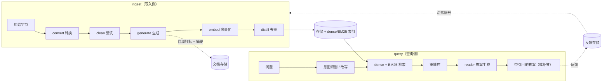

# SparkSage

[](https://pypi.org/project/sparksage/)
[](#许可证)
[](#开发)
[](https://pypi.org/project/sparksage/)
[](README.md)

**面向高质量 RAG 的结构化、问题对齐知识块。**

SparkSage 用 **IdeaBlock** 取代朴素的定长文本切片——一种与用户提问方式对
齐的、自包含的小型*知识单元*。SparkSage 不再嵌入会被从句中截断、检索效果
很差的任意文本片段，而是嵌入完整的、经过核验的答案。

它是一个**端到端的问答核心**：从原始字节到可检索、去重后的语料，再到有据可
查、带引用的答案。每个阶段都是一个可替换的协议（Protocol），并附带纯标准库
的默认实现，因此核心可完全离线运行，并可用确定性的 fake 对象做单元测试——你
只需安装真正需要的可选依赖。

> English documentation: [README.md](README.md)

---

## 安装

```bash
pip install sparksage                  # 仅核心（schema + 标准库默认实现）
pip install 'sparksage[llm,embed]'     # + 生成 + 向量化（OpenAI SDK）
pip install 'sparksage[convert]'       # + 任意文件 → Markdown（markitdown）
pip install 'sparksage[api]'           # + WEB API（FastAPI + uvicorn）
pip install 'sparksage[distill]'       # + 去重加速 + FaissVectorStore
pip install 'sparksage[chroma]'        # + ChromaVectorStore
pip install 'sparksage[pgvector]'      # + PgvectorVectorStore（Postgres）
pip install 'sparksage[rerank]'        # + cross-encoder 重排序
pip install 'sparksage[all]'           # 以上全部 + CJK（jieba）
```

> 每个子系统都只在需要它的后端内部**惰性导入**自己的 SDK，因此核心保持零依赖
> ——按需安装即可。

## SparkSage 管道

一句话概括——写入侧是 `bytes → convert → clean → generate → embed → distill`，
查询侧是 `question → intent → retrieve → answer`，并通过反馈回路把用户裁决转
化为写入侧的改进动作：



---

## 为什么要做“问题对齐”的知识块？

传统的 `RecursiveCharacterTextSplitter` 切块：

- 从句中被截断 → 语义被破坏，
- 不携带“它回答了什么问题”的信息 → 向量簇稀疏散乱，
- 缺少可查询的元数据 → 过滤 / 混合检索能力弱。

IdeaBlock 在数据层一次性解决这三个问题——而且红利会在下游每个阶段持续放大：

| 阶段 | 朴素 `RecursiveCharacterTextSplitter` | IdeaBlock |
| --- | --- | --- |
| 切分 | 句中截断 → 语义破坏 | 每块一个完整、核验过的 `trusted_answer` |
| 生成 | 不知道“回答了什么问题” | 每块都带 `critical_question` |
| 检索 | 元数据弱、向量簇稀疏 | `tags` / `entities` / `keywords` 可过滤 + 可加权 |
| 回答 | 碎片被重新拼接、易幻觉 | QA 对齐的上下文 + `source.locator` 引用 |

---

## IdeaBlock 数据结构

```xml
<ideablock>
  <name>标题 / short title</name>
  <critical_question>the single question this block answers?</critical_question>
  <trusted_answer>verified, self-consistent answer (2–3 sentences, ≤500 chars)</trusted_answer>
  <tags>IMPORTANT, TECHNOLOGY, ...</tags>
  <entity><entity_name>..</entity_name><entity_type>PRODUCT|..</entity_type></entity>
  <keywords>keywords for BM25 / lexical recall</keywords>
</ideablock>
```

同样的结构用 Python dict 表示（`to_xml()` / `from_xml()` 可无损往返）：

```python
{
    "name": "标题 / short title",
    "critical_question": "the single question this block answers?",
    "trusted_answer": "verified, self-consistent answer (2–3 sentences, ≤500 chars)",
    "tags": ["IMPORTANT", "TECHNOLOGY"],
    "entities": [{"entity_name": "..", "entity_type": "PRODUCT"}],
    "keywords": ["keywords", "for BM25", "lexical recall"],
}
```

核心模型：[`src/sparksage/schema/ideablock.py`](src/sparksage/schema/ideablock.py)。

### 设计原则

- **问答对齐** —— `critical_question` + `trusted_answer` 让块对齐到查询流形
  上，稠密向量因此围绕用户意图紧密聚集。
- **单字段向量化** —— 默认只嵌入 `trusted_answer`，彻底消除“切片把句子从中间
  切断”的问题。见 [`embedding_text`](src/sparksage/schema/ideablock.py)。
- **丰富、可查询的元数据** —— `tags` / `entities` / `keywords` 支撑过滤、权限
  隔离与混合（BM25 + dense）检索。
- **来源与生命周期** —— 每个块都知道自己的来源
  （[`SourceRef`](src/sparksage/schema/source.py)）和去重状态
  （`status` / `parents`），语料可审计，Distill 管道也能安全合并。

### TechnicalBlock（有序内容变体）

对于手册 / SOP / runbook 这类*顺序即语义*的内容，
[`TechnicalBlock`](src/sparksage/schema/technical.py) 在此基础上增加了：

- **有序、带角色标签的句子**（`INFO` / `COMMAND` / `WARNING` /
  `PREREQUISITE` / `REFERENCE` / `RESULT`），以及
- **Primary / Proceeding / Following** 上下文窗口。

它继承了完整的 IdeaBlock 核心，因此可与同一套检索栈互通。

---

## 快速开始

```bash
pip install -e ".[dev]"

python3 - <<'PY'
from sparksage.schema import IdeaBlock, Tag, Entity, EntityType, BlockStatus

block = IdeaBlock(
    name="What SparkSage does",
    critical_question="What problem does SparkSage solve?",
    trusted_answer=(
        "SparkSage turns documents into question-aligned knowledge units so "
        "retrieval hits whole, self-contained answers instead of text shards."
    ),
    tags=[Tag.IMPORTANT, Tag.TECHNOLOGY],
    entities=[Entity(entity_name="SparkSage", entity_type=EntityType.PRODUCT)],
    keywords=["rag", "chunking"],
    status=BlockStatus.ACTIVE,
)
print(block.embedding_text)
print(block.to_xml())
PY
```

更完整的端到端演示：

```bash
PYTHONPATH=src python3 examples/build_chunks.py
```

### 示例索引

除特别说明外，每个示例都**完全离线运行**（确定性 fake——无需 API key、无需
`markitdown`）。

| 示例 | 演示内容 |
| --- | --- |
| [`build_chunks.py`](examples/build_chunks.py) | IdeaBlock + TechnicalBlock 数据结构端到端 |
| [`generate_blocks.py`](examples/generate_blocks.py) | 自由文本 → 多个 IdeaBlock（经 LLM） |
| [`convert_files.py`](examples/convert_files.py) | 任意文件 → Markdown（单文件 + 批量目录） |
| [`clean_text.py`](examples/clean_text.py) | convert → clean → generate（来源感知规则） |
| [`search_blocks.py`](examples/search_blocks.py) | 向量化 → 建索引 → kNN 检索 → JSON 持久化 → 重载 |
| [`distill_blocks.py`](examples/distill_blocks.py) | 近似重复去重管道（聚类 → 合并） |
| [`extract_tags.py`](examples/extract_tags.py) | RAKE / TF-IDF / TextRank 自动打标（支持 CJK） |
| [`manage_documents.py`](examples/manage_documents.py) | 文档 CRUD + 标签词表（内存 / SQLite） |
| [`process_query.py`](examples/process_query.py) | 查询 → 意图分类 → 改写（多轮） |
| [`run_benchmark.py`](examples/run_benchmark.py) | IdeaBlock vs 朴素切块 → HTML 报告 |
| [`serve_api.py`](examples/serve_api.py) | FastAPI 服务：通过 TestClient 演示 `/convert` + `/generate` |
| [`qa_full_pipeline.py`](examples/qa_full_pipeline.py) | 完整知识问答：ingest → 检索 → 答案 + 反馈 |

---

## 从文本生成 IdeaBlock

SparkSage 通过 LLM 把一段自由文本拆解为若干问题对齐的 IdeaBlock。生成核心仅
依赖一个很小的 [`LLMClient`](src/sparksage/generator/client.py) 协议，因此兼容
任何 OpenAI 兼容端点（OpenAI、Azure、vLLM、Ollama、GLM……），并可完全离线用
确定性 fake 测试。

```bash
pip install 'sparksage[llm]'   # 拉取可选的 'openai' SDK
```

```python
from sparksage import IdeaBlockGenerator, OpenAICompatibleClient

client = OpenAICompatibleClient(api_key="...", model="gpt-4o-mini")
gen = IdeaBlockGenerator(client)

blocks = gen.generate(
    "SparkSage replaces naive text slicing with question-aligned chunks ...",
    source_uri="file://docs/overview.md",
)
for b in blocks:
    print(b.critical_question, "->", b.trusted_answer)
```

它如何保持稳健且 schema 安全：

- Prompt 会把 IdeaBlock 格式以及**实时读取自枚举定义的受控词表**
  （`Tag` / `EntityType`）教给模型，所以模型输出永远不会与代码脱节。
- 模型输出先解析为[宽松的中间模型](src/sparksage/generator/schema.py)，再通过
  词表**强制规整**为严格的 `IdeaBlock`。未知标签会被丢弃；`critical_question`
  会被修复为以 `?` 结尾；过长的答案会被跳过（拆成更多块，而不是截断）。
- `strict=True` 在第一个畸形块即快速失败；默认模式跳过坏块并通过
  `generate_with_stats()` 上报。
- 来源（`source_uri`）会附加到每个产出的块上。

离线演示（无需 API key）：

```bash
PYTHONPATH=src python3 examples/generate_blocks.py
```

---

## 把任意文件转换为 Markdown

切块之前，源文档格式各异。SparkSage 通过一个构建于 Microsoft
[`markitdown`](https://github.com/microsoft/markitdown) 之上的可插拔后端，把它们
统一归一为 Markdown（下游生成所期望的通用语）——支持 PDF、Word、PowerPoint、
Excel、HTML、CSV/JSON/XML、图片（EXIF + OCR）、音频（转写）、EPub、ZIP 归档等。

```bash
pip install 'sparksage[convert]'   # 拉取 markitdown[all]
```

```python
from sparksage import MarkdownConverter

conv = MarkdownConverter()

# 单文件 -> Markdown
result = conv.convert("report.pdf")
print(result.markdown)

# 整个目录树 -> .md 文件
conv.convert_directory("docs/", dest_dir="docs_md/")
```

返回的 [`ConversionResult`](src/sparksage/convert/converter.py) 可直接接入生成：

```python
blocks = IdeaBlockGenerator(client).generate(
    result.markdown, source=result.source_ref,
)
```

它如何保持稳健且依赖轻量：

- 转换核心只依赖一个很小的
  [`ConverterBackend`](src/sparksage/convert/backend.py) 协议，因此可完全离线用
  确定性 fake 做单元测试——`markitdown` 是惰性导入的，且仅在没有注入后端时才
  导入。
- 批量转换是**容错的**：单个坏文件会被记录并跳过，而不是中断整批运行。
- `convert_directory` 按一组合理的
  [`DEFAULT_EXTENSIONS`](src/sparksage/convert/converter.py) 过滤（可覆盖），默认
  递归；`convert_to_file` 为每个源写出 `<name>.md`。

离线演示（无需 `markitdown`）：

```bash
PYTHONPATH=src python3 examples/convert_files.py
```

---

## 清洗文档文本

转换产出的是忠实于原始字节的*原始* Markdown——但这样的文本很少能直接用于
生成：BOM、混杂的换行符、泄漏的控制字符、页眉页脚、水印、样板文字、PII 等。
**哪些算噪声取决于你的业务**，因此清洗被设计成可定制。

[`TextCleaner`](src/sparksage/clean/cleaner.py) 应用一条由微小、可组合规则构成的
管道。规则可以是**全局**的（每篇文档），也可以是**按来源 / 文件名**生效的（仅
PDF 页脚、仅 Confluence 宏……）：

```python
from sparksage import TextCleaner, RegexReplaceRule

cleaner = TextCleaner()                                     # 合理的默认值
cleaner.add(RegexReplaceRule(r"CONFIDENTIAL", ""))          # 每篇文档
cleaner.add(RegexReplaceRule(r"\b\d{3}-\d{2}-\d{4}\b", "[REDACTED]"))  # PII
cleaner.add_for("*.pdf", RegexReplaceRule(r"Page \d+ of \d+", ""))     # 仅 PDF 页脚

cleaned = cleaner.clean(raw_text, source="docs/report.pdf")
# 或直接从 ConversionResult 接入：
cleaned = cleaner.clean_result(conv_result)

blocks = IdeaBlockGenerator(client).generate(
    cleaned.text, source=cleaned.source_ref,
)
```

内置规则覆盖了对几乎所有文档都有帮助的归一化（`RemoveBomRule`、
`NormalizeLineEndingsRule`、`RemoveControlCharsRule`、`StripTrailingWhitespaceRule`、
`CollapseBlankLinesRule`、`RemoveHtmlCommentsRule`）。两个“逃生舱”让你无需写类即可
完成业务定制的精细处理：

- [`RegexReplaceRule`](src/sparksage/clean/rules.py) —— 基于正则的删除 / 替换
  （水印、页脚、脱敏、术语归一化）。
- [`CallableRule`](src/sparksage/clean/rules.py) —— 包装任意
  `(text, source) -> text` 函数。

要完全掌控，可实现
[`CleaningRule`](src/sparksage/clean/rules.py) 协议（仅一个 `clean` 方法）并注
册。来源路由位于
[`CleaningRegistry`](src/sparksage/clean/registry.py)，支持按 glob（同时匹配路径
和 basename）或正则匹配。

它如何保持稳健：

- 清洗核心只依赖 `CleaningRule` 协议和 `CleaningRegistry` 分发器——纯 Python，
  无外部依赖，可完全离线做单元测试。
- `DEFAULT_RULES` 先运行（先归一化字节，再上业务逻辑）；自定义规则按注册顺序叠
  加。传入 `use_defaults=False` 可获得完全控制。

离线演示（convert → clean → generate，无需 API key、无需 `markitdown`）：

```bash
PYTHONPATH=src python3 examples/clean_text.py
```

---

## 向量化与检索 IdeaBlock

拿到 IdeaBlock 之后，把它们向量化并按相似度检索。只有
[`embedding_text`](src/sparksage/schema/ideablock.py)（name + question + answer）
会被嵌入，所以被匹配到的是完整的、核验过的答案。

```bash
pip install 'sparksage[embed]'   # 拉取可选的 'openai' SDK
```

```python
from sparksage import (
    BlockEmbedder,
    InMemoryVectorStore,
    OpenAIEmbeddingClient,
)

client = OpenAIEmbeddingClient(api_key="...", model="text-embedding-3-small")
embedder = BlockEmbedder(client)

# vectors_for() 返回 {block_id: vector}，且不会修改块本身
# （让大规模语料保持内存轻量，向量不落到对象上）。
vectors = embedder.vectors_for(blocks)

store = InMemoryVectorStore(dimension=client.dimension)
store.add_many(vectors)

# 嵌入一段自由文本查询，然后在 store 里做 kNN 检索
query_vec = embedder.embed_texts(["how do I deploy sparksage?"])[0]
for hit in store.search(query_vec, k=5):
    print(hit.score, hit.block_id)
```

store 是**文本无关**的：它以不透明的 `block_id` 字符串为键索引向量，并计算纯点
积（余弦相似度，因为每个客户端都做 L2 归一化）。嵌入一段查询只需一次
`embed_texts` 调用——检索与向量化解耦，正如生成器与 LLM 客户端解耦一样。

它如何保持依赖轻量且可插拔：

- 检索核心只依赖一个很小的
  [`VectorStore`](src/sparksage/embed/store.py) 协议（`dimension` / `add` /
  `search`），因此可用
  [`FakeEmbeddingClient`](src/sparksage/embed/client.py) 完全离线做单元测试。
  暴力 [`InMemoryVectorStore`](src/sparksage/embed/store.py) 是纯标准库（无
  `numpy` / `faiss`）。
  [`embed/backends/`](src/sparksage/embed/backends/) 下的生产级后端各自惰性导入自
  己的 SDK，核心保持零依赖——按需安装：
  [`FaissVectorStore`](src/sparksage/embed/backends/faiss_store.py)（精确内积索引，
  `[distill]` extra）、
  [`ChromaVectorStore`](src/sparksage/embed/backends/chroma_store.py)（`[chroma]`）
  和 [`PgvectorVectorStore`](src/sparksage/embed/backends/pgvector_store.py)
  （`[pgvector]`，Supabase/Postgres）。三者都假设向量已 L2 归一化，返回的分数与
  `InMemoryVectorStore.search` 直接可比。
- 向量按值存储（add 时拷贝），调用方无法破坏索引。`search` 返回按最优优先排序
  的 [`SearchHit`](src/sparksage/embed/store.py)。
- [`save_store`](src/sparksage/embed/persist.py) /
  [`load_store`](src/sparksage/embed/persist.py) 把 store 持久化到**零依赖 JSON**
  文件，让向量在重启后依然存在；加载器会校验格式标记和版本，遇到损坏 / 外来 / 未
  来版本的文件会快速失败，而不是猜测。

```python
from sparksage import save_store, load_store

save_store(store, "corpus.json")     # 向量落盘
store = load_store("corpus.json")    # 下次运行重载（同一个 VectorStore）
```

### 查找近似重复的块

store 回答的是“与*这个查询*最相似的是什么？”——但 Distill 还需要“哪些块*彼此*
是重复的？”。这就是它的全量配对（all-pairs）对应物：

```python
from sparksage import find_similar_pairs

# vectors 即上面 vectors_for() 返回的 {block_id: vector}
for pair in find_similar_pairs(vectors, threshold=0.6):
    print(f"{pair.score:.3f}  {pair.a} ~ {pair.b}")
```

`find_similar_pairs` 是纯标准库（`O(n²·d)`，对几千个块足够），每个无序对只返回
一次（`a <= b`），按分数再按 id 排序以保证确定性。它是 Distill 去重管道的第一
个零依赖步骤；百万向量规模下，`[distill]` extra 下的近似 LSH + FAISS 候选缩减
会接管。

离线演示（向量化 → 建索引 → 检索 → 持久化 → 重载，无需 API key）：

```bash
PYTHONPATH=src python3 examples/search_blocks.py
```

---

## 用 Distill 去重

语料一旦向量化，近似重复就会出现——同一事实在不同文档里被重述、一个答案的细
微改写、一段复制粘贴的流程。**Distill** 把它们折叠成更少、更完整的规范
IdeaBlock。它建立在已有构件之上，而非另起炉灶：

- 候选检测复用 `find_similar_pairs`；
- 聚类是一个协议，默认是纯标准库实现（并查集连通分量），`[distill]` 下有可选的
  Louvain 后端；
- 合并步骤复用现有的 `LLMClient` 协议；
- 生命周期回写使用 schema 里为此预留的字段——`status` / `parents` /
  `confidence`。

```python
from sparksage import BlockEmbedder, OpenAIEmbeddingClient, OpenAICompatibleClient
from sparksage.distill import DistillPipeline, BlockMerger

embedder = BlockEmbedder(OpenAIEmbeddingClient(api_key="..."))
merger = BlockMerger(OpenAICompatibleClient(api_key="...", model="gpt-4o-mini"))
pipe = DistillPipeline(embedder=embedder, merger=merger)

result = pipe.run(blocks)
print(f"{len(blocks)} -> {len(result.survivors)} blocks ({result.reduction:.1%} dedup)")

# result.survivors   -> 合并后的规范块 + 未被触及的单例，均为 ACTIVE
# result.merged_out  -> 被折叠的块，status=MERGED（保留用于审计 / 回滚）
# result.stats       -> 每轮诊断（阈值、配对数、簇数）
```

该管道运行的是**迭代式阈值收紧**：从宽松起步（默认 `0.55`），合并明显的重复
项，重新向量化规范块，再每轮收紧 `+0.01`（上限 `0.98`，约 4 轮）。这样能把单次
扫描会漏掉的*重复链*也折叠掉，同时永远不会在收紧后的阈值之下合并。大于单次预
算（默认 20）的簇会被**按最强簇内边层次化切分**，自底向上合并后再次合并——因此
即便一个 1 万块的簇，每次调用也不会超过一个 LLM 上下文。

它如何保持依赖轻量且可插拔：

- 管道只依赖三个协议——`EmbeddingClient`（经 `BlockEmbedder`）、`LLMClient`
  （经 `BlockMerger`）和 `ClusteringBackend`——因此可用 `FakeEmbeddingClient` /
  `FakeLLMClient` 完全离线做单元测试。`numpy` / `networkx` / `python-louvain`
  属于可选的 `[distill]` extra，仅在 `LouvainClusteringBackend` 内部惰性导入。
- 被合并掉的块置 `status=MERGED`；规范块置 `status=ACTIVE`，`parents` 为被合并
  的 UUID，`confidence` 为该簇的平均两两相似度。一切都不离开 IdeaBlock 数据模
  型。
- 合并步骤是**容错的**：在非严格模式（默认）下，一个坏的 LLM 输出会回退为提升
  某个成员，而不是让一个 10 万块的运行整体中止。

对于非常大的语料（≥ 约 1000 块），安装加速依赖并让管道自动选择 Louvain 后端：

```bash
pip install 'sparksage[distill]'   # numpy + networkx + python-louvain
```

离线演示（无需 API key；脚本化的 FakeLLMClient 会执行一次真实合并）：

```bash
PYTHONPATH=src python3 examples/distill_blocks.py
```

---

## 给文档自动打标

语料的可过滤程度，取决于它的元数据质量。当一篇文档到达时*没有*标签，SparkSage
会用经典、**零依赖**的算法从内容里推导出标签——核心不依赖 LLM、NLTK / spaCy /
jieba。`tags/` 包只依赖一个很小的
[`Tokenizer`](src/sparksage/tags/tokenizer.py) 协议和
[`stoplist.py`](src/sparksage/tags/stoplist.py) 里的停用词集：

```python
from sparksage import make_extractor

extractor = make_extractor("rake")          # 或 "tfidf" / "textrank"
for ks in extractor.extract(my_text, top_k=8):
    print(f"{ks.score:.3f}  {ks.keyword}")
```

内置三个抽取器，都是纯标准库：

- [`RakeKeywordExtractor`](src/sparksage/tags/extractor.py) —— 短语共现打分
  （默认；速度快，英文效果好）。
- [`TfidfKeywordExtractor`](src/sparksage/tags/extractor.py) —— 在文档自身句子上
  的词频 × 逆文档频率。
- [`TextRankKeywordExtractor`](src/sparksage/tags/extractor.py) —— 词共现图 +
  PageRank。

CJK（中文 / 日文 / 韩文）开箱即用，靠的是无词典的
[`CharBigramTokenizer`](src/sparksage/tags/tokenizer.py)（重叠的字符二元组带有
很强的话题信号）。词级别的中文分词是 `[tags-zh]` 下的可选
[`JiebaTokenizer`](src/sparksage/tags/tokenizer.py)，像所有其他可选 SDK 一样惰性
导入。[`AutoTokenizer`](src/sparksage/tags/tokenizer.py) 会检查文本并把 CJK 路由
到二元组、把拉丁字母路由到空白分词，是每个抽取器的默认分词器。

标签是**自由格式**的（`KeywordScore.keyword → list[str]` 落到文档上）——刻意*不*
使用封闭的 [`Tag`](src/sparksage/schema/enums.py) 枚举，后者仍保留其粗粒度语义
过滤的角色。`make_extractor(name)` 是配置驱动的工厂（未知名称会快速失败）。

离线演示（无依赖，演练全部三种算法）：

```bash
PYTHONPATH=src python3 examples/extract_tags.py
```

---

## 管理文档

过去没有*文档*对象——只有块级别的 IdeaBlock。`documents/` 包用
[`DocumentRecord`](src/sparksage/documents/models.py) 填补了这个空缺：一个 Pydantic
v2 实体（`extra="forbid"`，与所有 schema 模型一致），携带 `title` / `summary` /
`body_markdown` / **自由格式** `tags: list[str]` /
[`SourceRef`](src/sparksage/schema/source.py) 来源 / 时间戳 / 一个用于廉价变更检测
的 `content_hash`。

```python
from sparksage import (
    InMemoryDocumentStore, SqliteDocumentStore, new_record,
)

# 临时（适合测试 / 单进程）
store = InMemoryDocumentStore()

# 或持久化（单文件 SQLite，无需服务器）
store = SqliteDocumentStore("./docs.db")

record = store.save(new_record(
    title="Annual Report",
    body_markdown="# Annual Report\nRevenue grew 12% ...",
    tags=["revenue", "annual"],
    source="file://docs/annual_report.md",
))
for r in store.list(tag="revenue", limit=10):
    print(r.doc_id, r.title, r.tags)
```

存储层只依赖
[`DocumentStore`](src/sparksage/documents/store.py) 协议
（`save`/`get`/`list`/`delete`/`count`/`list_tags`/`__contains__`/`__len__`）——核
心里从不依赖 `sqlite3` 专有 SQL。
[`InMemoryDocumentStore`](src/sparksage/documents/backends/memory.py) 是纯标准库；
持久的
[`SqliteDocumentStore`](src/sparksage/documents/backends/sqlite.py) 拥有一张
`documents` 表加上一张 `<table>_tags` 关联表用于精确匹配的标签过滤，并在 FastAPI
线程池中线程安全。

[`ExtractiveSummarizer`](src/sparksage/documents/summarizer.py) 产出文档级摘要：按
词频打分的句子按原文顺序返回，剥离 Markdown 标题 / 强调标记——无需 LLM。

离线演示（内存 store → CRUD → 标签词表；无需 API key，不保留 SQLite 文件）：

```bash
PYTHONPATH=src python3 examples/manage_documents.py
```

---

## 处理查询（意图 + 改写）

查询时是 ingest 管道的对偶。在一个问题进入检索之前，SparkSage 会分类它的意图、
拦截域外 / 低置信度的查询，并把（可能是多轮、指代繁多的）措辞改写成适合搜索的
文本。`query/` 包复用现有的
[`LLMClient`](src/sparksage/generator/client.py) 协议——绝不依赖具体的 LLM SDK
——因此可在 [`FakeLLMClient`](src/sparksage/generator/client.py) 下完全离线运行。

```python
from sparksage import (
    OpenAICompatibleClient, QueryIntent,
)
from sparksage.query import (
    QueryProcessor, LLMIntentClassifier, LLMQueryRewriter,
    RuleIntentClassifier, KeywordIntentRule,
    ConversationContext,
)

client = OpenAICompatibleClient(api_key="...", model="gpt-4o-mini")
proc = QueryProcessor(
    classifier=RuleIntentClassifier([
        KeywordIntentRule(("weather", "笑话"), QueryIntent.OUT_OF_DOMAIN),
    ]),
    rewriter=LLMQueryRewriter(client),
)

# 第一轮
result = proc.process("中国移动2024年净利润怎么样")
if result.accepted:
    retrieve(result.rewrite.rewritten_query)   # 例如 "China Mobile 2024 net profit"
else:
    show(result.default_reply)

# 后续轮——指代（"那联通呢"）对照历史解析
ctx = ConversationContext().with_turn("user", "...the China Mobile answer...")
result = proc.process("那联通呢", context=ctx)
```

这两个阶段是相互独立、可替换的协议，各自有一个 LLM 默认实现和一个无 LLM 的规则
实现，用于“高频模式先走规则”的成本控制模式：

- [`IntentClassifier`](src/sparksage/query/classifier.py) —— 默认
  [`LLMIntentClassifier`](src/sparksage/query/classifier.py)（思维链 + JSON，基于
  **实时**的 [`QueryIntent`](src/sparksage/schema/enums.py) 词表），或
  [`RuleIntentClassifier`](src/sparksage/query/classifier.py) 做关键词 / 正则路由。
- [`QueryRewriter`](src/sparksage/query/rewriter.py) —— 默认
  [`LLMQueryRewriter`](src/sparksage/query/rewriter.py)，或
  [`RuleQueryRewriter`](src/sparksage/query/rewriter.py) 做模板规则。

[`QueryProcessor`](src/sparksage/query/processor.py) 用一套**拦截策略**把它们串起
来：拒绝哪些意图（默认 `OUT_OF_DOMAIN`）、`min_confidence` 下限（`0.4`）和 canned
回复——全部是配置项，而非隐藏行为。宽松→严格的两段式模式与 `generator/` 如出一
辙：原始 LLM 输出先解析为宽松的 `RawIntent` / `RawRewrite`，再通过 `QueryIntent`
枚举强制规整为严格的 `IntentResult` / `RewriteResult`。
[`ConversationContext`](src/sparksage/query/context.py) 是一个一等、不可变的值对
象，被烘进改写 prompt，所以多轮指代解析（“那”“it”“the same”）从第一天就支持。

### 多查询扩展与语义缓存

两个可选增强同样搭载于 `LLMClient` 协议，并喂给端到端的
[`QAEngine`](#端到端提问)：

- [`QueryExpander`](src/sparksage/query/expander.py) —— 默认
  [`LLMQueryExpander`](src/sparksage/query/expander.py) 产出 `n` 个改写变体（默认
  `3`）用于 RRF 融合的多查询召回；
  [`IdentityExpander`](src/sparksage/query/expander.py) 是 no-op。它与改写器（改出
  一个更好的查询）以及子查询分解（把复合问题拆成几部分）正交。
- [`InMemorySemanticCache`](src/sparksage/query/cache.py) —— 对近似重复的重复查询
  短路掉整个 QA 管道（最大的成本杠杆，因为 LLM 调用是大头）。它通过
  `EmbeddingClient` 按查询*含义*做键（余弦 ≥ `0.90`，默认），结构化地实现
  `QACache` 协议，且是纯标准库，可用 `FakeEmbeddingClient` 做单元测试。
- [`SelfQueryParser`](src/sparksage/query/self_query.py) —— 默认
  [`LLMSelfQueryParser`](src/sparksage/query/self_query.py) 把一个自然语言问题拆成
  一个干净查询**外加一个 `RetrievalFilter`**（标签实时读取自 `Tag` 枚举，自由格式
  的实体 / 语言），所以 `"2025 华东区销售数据"` 会变成 `query="销售数据"` 并带上抽
  取出的元数据作用域；
  [`IdentitySelfQueryParser`](src/sparksage/query/self_query.py) 是 no-op。把它接在
  `Retriever.search` 之前，并直接透传它的 `filter`。

> **注意：** 这是框架无关的核心。未来的 `/api/v1/query` 路由会是一层薄包装，镜像
> [`SparkSageService`](src/sparksage/api/pipeline.py) 包装 ingest 管道的方式。

离线演示（规则分类器 + 脚本化 FakeLLMClient 改写器；无需 API key）：

```bash
PYTHONPATH=src python3 examples/process_query.py
```

---

## 检索 IdeaBlock（混合检索）

`retrieve/` 包是 ingest 管道的查询侧对偶，也是最终*消费*那三个“设计了却没被消
费”的 IdeaBlock 字段的层：`keywords` 驱动 BM25，`tags` / `entities` / `language`
/ `kb_id` 限定结果范围，`source.locator` 给引用提供依据。它只依赖现有的
`VectorStore` / `BlockEmbedder` 协议加上两个新协议（`LexicalRetriever`、
`Reranker`）——核心里绝不依赖搜索引擎或重排序 SDK。

```python
from sparksage import (
    BlockEmbedder, FakeEmbeddingClient, IdeaBlock, InMemoryVectorStore,
    BM25Retriever, Retriever, RetrievalFilter, Tag,
)

registry: dict[str, IdeaBlock] = {}                       # 由 .index() 填充
embedder = BlockEmbedder(FakeEmbeddingClient(dimension=64))
retriever = Retriever(
    registry, InMemoryVectorStore(dimension=64), embedder,
    lexical=BM25Retriever(),                              # 混合检索的稀疏半边
)
retriever.index(blocks)                                   # 一次调用建好 dense + lexical

result = retriever.search(
    "how do I deploy?", k=5,
    filter=RetrievalFilter(tags={Tag.IMPORTANT}),         # 对元数据做后过滤
)
for chunk in result.chunks:
    print(chunk.score, chunk.block.critical_question)
    print("  citation:", chunk.to_citation())             # 携带 source.locator
```

`Retriever.search` 运行 dense kNN + 可选 BM25，用
[reciprocal rank fusion](src/sparksage/retrieve/fusion.py)（免分数，所以余弦和
BM25 分数保持可比）融合两个排序列表，再对块注册表（store 刻意做成文本无关）做后
过滤，可选地重排序，最后截断到 `k`。`RetrievedChunk.to_citation()` 暴露
`source.uri` + `source.locator`——读者据此把引用落地。

它如何保持依赖轻量且可插拔：

- [`BM25Retriever`](src/sparksage/retrieve/lexical.py) 是稀疏半边：每个块变成一个
  BM25 文档，其词袋加权了精选的 `keywords` 字段（×3）外加答案 / 问题 / name 文
  本；CJK 被切分为一元词 + 重叠二元词（无词典，如同 `tags` 分词器）。纯标准库，
  无 `rank_bm25`。
- [`reciprocal_rank_fusion`](src/sparksage/retrieve/fusion.py) 是 dense + lexical
  （或多查询）排序列表的免分数 RRF 合并——与 QA 引擎多查询检索用的是同一个融合
  步骤。
- [`Reranker`](src/sparksage/retrieve/reranker.py) 协议提供
  [`LLMReranker`](src/sparksage/retrieve/reranker.py)（复用 `LLMClient`，宽松→严格
  的索引列表规整，坏响应时回退为恒等）和
  [`IdentityReranker`](src/sparksage/retrieve/reranker.py) no-op。具体后端
  [`CrossEncoderReranker`](src/sparksage/retrieve/backends/cross_encoder.py)
  （`[rerank]` extra，经 `sentence-transformers`）用每对一个 cross-attention pass
  对融合后的池重新打分——除切块策略之外最大的单点杠杆，且每查询成本远低于
  `LLMReranker`。
- [`RetrievalFilter`](src/sparksage/retrieve/models.py) 是对过量取回的 dense 池做
  的*后过滤*（`tags` / `entities` / `language` / `kb_id` / `block_ids`）；若要精
  确的带过滤 kNN，可换用支持原生元数据过滤的后端。

---

## 生成有依据的答案

`reader/` 包是答案生成阶段——QA 管道缺失的“右半边”。它只依赖两个新协议，
`AnswerGenerator` 和 `FaithfulnessJudge`，二者都复用现有的
[`LLMClient`](src/sparksage/generator/client.py)（绝不另造一个 LLM 抽象）。

```python
from sparksage import (
    OpenAICompatibleClient,
    LLMAnswerGenerator, LLMFaithfulnessJudge, Reader,
)

client = OpenAICompatibleClient(api_key="...", model="gpt-4o-mini")
reader = Reader(
    generator=LLMAnswerGenerator(client),
    faithfulness_judge=LLMFaithfulnessJudge(client),   # 可选
)

result = reader.answer("how do I deploy?", retrieved_chunks)
if result.abstained:
    print(result.abstention_reason)                    # 例如 "faithfulness 0.32 below floor 0.50"
else:
    print(result.answer.text)
    for c in result.answer.citations:                  # 绑定到 source.locator
        print(f"  [{c.block_id}] {c.uri}:{c.locator}")
```

[`LLMAnswerGenerator`](src/sparksage/reader/generator.py) 把每个候选的
`critical_question` + `trusted_answer`（IdeaBlock 的 QA 对齐红利）喂给模型，输出带
引用的 JSON 答案（引用指向块 id）；宽松→严格的规整把这些 id 绑定到 schema 的
`source.uri` / `source.locator`，并*丢弃*不在已检索集合中的幻觉 id。
[`LLMFaithfulnessJudge`](src/sparksage/reader/faithfulness.py) 打分答案有多大程度被
支撑（LLM 作裁判，坏响应时退化为一个默认值）。
[`Reader`](src/sparksage/reader/orchestrator.py) 运行 生成 →（裁判）→ 拒答：低于
`min_faithfulness`（`0.5`）或 `min_confidence`（`0.2`）时返回拒答回复而不是幻觉
——这是 [`QueryProcessor`](src/sparksage/query/processor.py) 查询侧 `min_confidence`
的对称答案侧闸门。`Reader` 还拥有 **Context-Cliff 守卫**：可选的
`max_context_tokens=` 在生成和裁判*之前*把最优优先的块列表裁剪到一个 token 预算
（[`trim_to_token_budget`](src/sparksage/reader/budget.py)，纯标准库的
`len/chars_per_token` 启发式，可插拔 `token_counter=` 做精确分词，`keep_min=` 下
限）——这样裁判针对的正是生成器看到的上下文打分，避免过大的 top-k 导致的“中间
丢失”退化。

---

## 端到端提问

`qa/` 包是框架无关的编排器，终于让 SparkSage 成为一个端到端的问答核心。
[`QAEngine`](src/sparksage/qa/engine.py) 把 查询 → 检索 → 答案 串起来，自身不带任
何业务逻辑——每个阶段都是可替换的协议（`QueryProcessor` / `QueryExpander` /
`Retriever` / `Reader` / `QACache`，均可选）。

```python
from sparksage import (
    IdeaBlock,
    OpenAICompatibleClient, OpenAIEmbeddingClient,
    QueryProcessor, LLMIntentClassifier, LLMQueryRewriter,
    BlockEmbedder, InMemoryVectorStore, BM25Retriever, Retriever,
    LLMAnswerGenerator, LLMFaithfulnessJudge, Reader,
    QAEngine, InMemorySemanticCache,
)

llm = OpenAICompatibleClient(api_key="...", model="gpt-4o-mini")
embedder = BlockEmbedder(OpenAIEmbeddingClient(api_key="..."))

registry: dict[str, IdeaBlock] = {}
retriever = Retriever(
    registry, InMemoryVectorStore(dimension=embedder.dimension), embedder,
    lexical=BM25Retriever(),
)
retriever.index(blocks)

engine = QAEngine(
    retriever=retriever,
    reader=Reader(
        generator=LLMAnswerGenerator(llm),
        faithfulness_judge=LLMFaithfulnessJudge(llm),
    ),
    query_processor=QueryProcessor(
        classifier=LLMIntentClassifier(llm),
        rewriter=LLMQueryRewriter(llm),
    ),
    cache=InMemorySemanticCache(embedder.client),       # 重复查询短路
)

result = engine.ask("中国移动2024年净利润怎么样")
print(result.text)                                       # 有依据的答案或拒答
print(result.citations)                                  # 绑定到 source.locator
```

它消费改写器的 `sub_queries`（COMPARISON / 多跳分解）以及扩展器的变体，走的还是
同一条 RRF 融合的多查询取回路径：每个查询独立检索（重排序推迟到融合后的池），
然后 [`reciprocal_rank_fusion`](src/sparksage/retrieve/fusion.py) 合并排序列表，
再由 reader 生成一个答案。可选的
[`QACache`](src/sparksage/qa/engine.py)（由
[`InMemorySemanticCache`](src/sparksage/query/cache.py) 实现）对近似重复的重复查
询短路掉整条管道。

> **注意：** 尚未接入 web 层——未来的 `/api/v1/query` 路由会是 `QAEngine.ask` 的
> 一层薄包装，正如
> [`SparkSageService`](src/sparksage/api/pipeline.py) 包装 ingest。

---

## 组织知识库

`kb/` 包是多租户的聚合根——扁平的
[`documents/DocumentStore`](src/sparksage/documents/store.py) 所欠缺的组织实体。
[`KnowledgeBase`](src/sparksage/kb/knowledge_base.py) 拥有文档 + 它们的 IdeaBlock
+ 一个 dense `VectorStore` + 一个 `BM25Retriever` + 一个 `Retriever`，并且至关重
要地拥有它们之间的**一致性**。

```python
from sparksage import (
    KnowledgeBase, KnowledgeBaseInfo, InMemoryKnowledgeBaseStore,
    BlockEmbedder, OpenAIEmbeddingClient, new_record,
)

kb = KnowledgeBase(
    info=KnowledgeBaseInfo(name="Product Docs", language="en"),
    embedder=BlockEmbedder(OpenAIEmbeddingClient(api_key="...")),
)

kb.add_document(
    new_record(title="Annual Report", body_markdown="# Annual Report\n..."),
    blocks=blocks,                                       # 向量化 + 建索引，并盖上 kb_id
)

result = kb.search("revenue growth", k=5)                # 检索限定在本 KB 内
print(kb.block_count(), kb.document_count())

registry = InMemoryKnowledgeBaseStore()                  # 多租户注册表
registry.save(kb.info)
```

- [`add_blocks`](src/sparksage/kb/knowledge_base.py) 盖上 `kb_id` 并向量化 + 建索
  引；[`remove_document`](src/sparksage/kb/knowledge_base.py) 级联到块向量 + 注册表
  （索引↔存储一致性保证）。
- [`update_document`](src/sparksage/kb/knowledge_base.py) **仅当 `content_hash` 变
  化时**才做增量重建索引（哈希感知的变更检测）。
- [`reindex`](src/sparksage/kb/knowledge_base.py) 从实时注册表重建两个索引（漂移
  恢复）。
- 每个块携带一个可选的附加 `kb_id`
  （[`schema/ideablock.py`](src/sparksage/schema/ideablock.py)），使
  [`RetrievalFilter`](src/sparksage/retrieve/models.py) 能把检索限定到某个 KB。

---

## 基准对比 IdeaBlock 与朴素切块

阻碍采用的那个问题——*“问题对齐的 IdeaBlock 设计真的比人人都在用的递归字符切
片器更好吗？”*——可以**在你自己的语料上、可衡量地**回答。基准测试复用现有的
`BlockEmbedder` 和 `InMemoryVectorStore`，只额外加了一个零依赖的 LangChain 递归切
片器复刻作为基线：

```python
from sparksage import BlockEmbedder, OpenAIEmbeddingClient
from sparksage.bench import BenchmarkRunner

runner = BenchmarkRunner(
    embedder=BlockEmbedder(OpenAIEmbeddingClient(api_key="...")),
)
report = runner.run(my_blocks)

print(report.summary())
open("benchmark.html", "w").write(report.to_html())   # 自包含的报告
```

runner 在*同一语料*上构建**两个索引**——每个 IdeaBlock 一个向量 vs 每个朴素块一
个向量——对两者运行*同一组查询*（每个块的 `critical_question`，ground truth = 该
块自身），并打分 top-k 检索（**hit@k**、**MRR**、平均最高分）+ token 效率。比较
天然公平：同样的向量化器、同样的查询、同样的 ground truth——只有切块策略不同。

`BenchmarkReport.to_html()` 渲染一个自包含的 HTML 页面（无外部 CSS/JS、无模板引
擎），含并排指标、提升倍数和配置快照——一份“在你自己的数据上证明 ROI”的产物，
可作为单个文件分享。通过 `BenchmarkRunner(token_counter=...)` 接入真实分词器以获
得绝对 token 数。

它如何保持依赖轻量：

- runner 是纯标准库 + 你已有的向量化客户端——无 LangChain、无指标库、无模板引
  擎。它可用 `FakeEmbeddingClient` 离线运行。
- `RecursiveCharSplitter` 是 `RecursiveCharacterTextSplitter`（LangChain 默认）的
  忠实复刻，因此基线无需额外安装即可复现。

离线演示（无需 API key）：

```bash
PYTHONPATH=src python3 examples/run_benchmark.py
```

---

## 评估答案正确性

`eval/` 包是 `bench/`（仅打分检索）的答案正确性对偶：`bench` 问“正确的块浮现出
来了吗？”，`eval` 问“生成的答案真的正确吗？”。
[`QAEvaluator`](src/sparksage/eval/evaluator.py) 在一组
[`QATestCase`](src/sparksage/eval/models.py) 上运行
[`QAEngine`](src/sparksage/qa/engine.py)，并把逐案例结果汇总为
[`QAEvalReport`](src/sparksage/eval/models.py)：平均答案正确性、拒答率、检索
hit@k（为可比性复用
[`bench.evaluate_retrieval`](src/sparksage/bench/metrics.py)）以及平均忠实度。

```python
from sparksage import QAEvaluator, QATestCase, TokenOverlapJudge

evaluator = QAEvaluator(engine)                          # 任意 QAEngine
report = evaluator.run([
    QATestCase(
        query="how do I deploy sparksage?",
        reference_answer="Run uvicorn sparksage.api.app:create_app ...",
        relevant_block_ids={"block-uuid-1", "block-uuid-2"},
    ),
    # ...
])

print(report.mean_correctness, report.abstention_rate, report.retrieval.mrr)
```

正确性是一个可插拔的 [`CorrectnessJudge`](src/sparksage/eval/evaluator.py)：默认的
[`TokenOverlapJudge`](src/sparksage/eval/evaluator.py) 是零依赖的 token-F1（完全离
线，CJK 友好，见
[`token_f1`](src/sparksage/eval/evaluator.py)）；
[`LLMCorrectnessJudge`](src/sparksage/eval/evaluator.py) 可替换（复用 `LLMClient`，
坏响应时回退到 token-F1）做语义打分。当某案例没有 `reference_answer` 时，正确性
会回退到一个“检索命中 + 忠实度”的代理指标。

---

## 闭合反馈回路

`feedback/` 包闭合了查询 → ingest 回路（质量飞轮）。
[`FeedbackRecord`](src/sparksage/feedback/models.py)（Pydantic v2，`extra="forbid"`，
封闭的 [`FeedbackRating`](src/sparksage/feedback/models.py) 枚举）捕获用户对所呈现
答案的裁决（正面 / 负面 / 已纠正），外加可选的更正和支撑它的块 id。
[`FeedbackStore`](src/sparksage/feedback/store.py) 协议 +
[`InMemoryFeedbackStore`](src/sparksage/feedback/store.py) 负责持久化 + 聚合（通过
率、按块细分）。

```python
from sparksage import (
    InMemoryFeedbackStore, FeedbackRecord, FeedbackRating,
    extract_healing_signals,
)

store = InMemoryFeedbackStore()
store.add(FeedbackRecord(
    query="how do I deploy?",
    answer_text="...",
    rating=FeedbackRating.NEGATIVE,
    block_ids=["block-uuid-1"],
))

report = extract_healing_signals(store)
print(report.approval)                                   # 头条健康指标
for sig in report.low_recall:                            # 召回缺口 -> 重新切块 / 补内容
    print("low recall:", sig.query, sig.occurrences)
for sig in report.split_candidates:                      # 差评率高的块 -> 拆分
    print("split:", sig.block_id, sig.bad_ratio)
```

[`extract_healing_signals`](src/sparksage/feedback/healing.py)（纯标准库）把聚合再
次转化为 ingest 动作：反复出现的低召回查询标记一个覆盖缺口（重新切块 / 补充内
容）；差评率高的块成为拆分候选（Distill *合并* 的逆操作）。

---

## 提供 WEB API

SparkSage 通过一个小型 HTTP API 暴露其能力：

* `POST /api/v1/convert` —— 上传文件，返回 Markdown（可选清洗）。
* `POST /api/v1/generate` —— 上传文件，返回 IdeaBlock 列表。
* `POST /api/v1/documents` —— 上传文件 → 解析 → 清洗 →（自动打标）→（摘要）→
  存储一条 [`DocumentRecord`](src/sparksage/documents/models.py)。
* `GET /api/v1/documents` —— 分页列表（`?tag=` / `?q=` 过滤）。
* `GET / PATCH / DELETE /api/v1/documents/{doc_id}` —— 单文档 CRUD。
* `POST /api/v1/documents/{doc_id}/tags` —— 从正文重新抽取标签。
* `GET /api/v1/tags` —— 已存储文档的去重标签词表。
* `GET /api/v1/health` —— 存活探针；上报版本号以及是否已配置生成。供 Docker
  `HEALTHCHECK` 使用。

API 层是框架无关的
[`SparkSageService`](src/sparksage/api/pipeline.py) 之上的一层薄壳，后者把
convert → clean → generate（对文档还有 → 自动打标 → 摘要 → 存储）串起来。
FastAPI 是一个*可选*依赖。

```bash
pip install 'sparksage[api]'          # fastapi + uvicorn + python-multipart
pip install 'sparksage[convert]'      # markitdown，用于真实文件转换
pip install 'sparksage[llm]'          # openai SDK，用于真实生成
```

#### 向量存储后端

默认的 `InMemoryVectorStore` 不需要任何依赖。要做生产级检索，按需安装后端：

```bash
pip install 'sparksage[distill]'      # FaissVectorStore（faiss-cpu + numpy）
pip install 'sparksage[chroma]'       # ChromaVectorStore（ChromaDB，本地开发优先）
pip install 'sparksage[pgvector]'     # PgvectorVectorStore（psycopg v3 + Postgres）
```

三者实现同一个 `VectorStore` 协议，因此可在任何用到 `InMemoryVectorStore` 的地方
替换。

#### 重排序后端

默认的 `LLMReranker` / `IdentityReranker` 无需额外依赖。要用精度更高、单查询成本
更低的 cross-encoder 重排序器：

```bash
pip install 'sparksage[rerank]'       # CrossEncoderReranker（sentence-transformers）
```

它实现同一个 `Reranker` 协议，因此可直接插入 `Retriever`（以及 `QAEngine`）的
`reranker=` 槽位，无需改动。

### 运行服务

```bash
export SPARKSAGE_API_KEY=sk-...                    # 或 OPENAI_API_KEY
export SPARKSAGE_MODEL=gpt-4o-mini                 # 可选
export SPARKSAGE_BASE_URL=https://your-endpoint/v1 # 自定义端点（可选）
export SPARKSAGE_STREAM=true                       # 流式模式（默认）
uvicorn sparksage.api.app:create_app --factory --port 8000
```

更想用 `.env` 文件？见[配置](#配置)——内置加载器（`cp .env.example .env`）意味着
不依赖 `python-dotenv`。

交互式文档自动生成在 `http://localhost:8000/docs`。

### 调用端点

```bash
# 1) 文件 -> Markdown（可选清洗）
curl -F "file=@report.pdf" -F "clean=true" \
     http://localhost:8000/api/v1/convert

# 2) 文件 -> IdeaBlock 列表
curl -F "file=@report.pdf" -F "with_stats=true" \
     http://localhost:8000/api/v1/generate

# 3) 文件 -> 已存储文档（自动打标 + 摘要）
curl -F "file=@report.pdf" -F "top_k=8" \
     http://localhost:8000/api/v1/documents

# 4) 列出 / 过滤文档（可选 ?tag= 和 ?q=）
curl "http://localhost:8000/api/v1/documents?tag=revenue&limit=10"

# 5) 已存储文档的去重标签词表
curl http://localhost:8000/api/v1/tags
```

`POST /api/v1/convert` 返回：

```json
{
  "markdown": "# Report\n\nRevenue grew 12% ...",
  "title": "Annual Report",
  "source": {"uri": "report.pdf", "title": "Annual Report"},
  "cleaned": true
}
```

`POST /api/v1/generate` 返回：

```json
{
  "blocks": [
    {
      "name": "Revenue growth",
      "critical_question": "How did revenue change?",
      "trusted_answer": "Revenue grew 12% year over year.",
      "tags": ["IMPORTANT"],
      "keywords": ["revenue"],
      "source": {"uri": "report.pdf"},
      "status": "draft",
      "language": "en"
    }
  ],
  "source": {"uri": "report.pdf", "title": "Annual Report"},
  "cleaned": true,
  "stats": {"raw_block_count": 1, "emitted": 1, "skipped": 0, "errors": []}
}
```

`POST /api/v1/documents` 返回已存储记录（未提供标签时自动抽取；摘要由抽取式摘要
器生成）：

```json
{
  "doc_id": "b8e1...c4",
  "title": "Annual Report",
  "summary": "Revenue grew 12% year over year.",
  "body_markdown": "# Annual Report\nRevenue grew 12% ...",
  "tags": ["revenue", "annual", "growth"],
  "source": {"uri": "report.pdf", "title": "Annual Report"},
  "content_hash": "0bd7d516...",
  "created_at": "2026-07-26T07:30:00Z",
  "updated_at": "2026-07-26T07:30:00Z"
}
```

它如何保持可测试且可插拔：

- 编排全部位于
  [`SparkSageService`](src/sparksage/api/pipeline.py)——无 HTTP 导入——因此可用
  fake 完全离线做单元测试。FastAPI 层只负责上传 / 序列化。
- `create_app(service=...)` 接受注入的 service（用于测试）；省略时则从环境变量构
  建（`SPARKSAGE_API_KEY` / `OPENAI_API_KEY`，加上 `SPARKSAGE_DOC_STORE` → 持久
  的 `SqliteDocumentStore`，`SPARKSAGE_AUTO_TAG_EXTRACTOR` =
  rake|tfidf|textrank，`SPARKSAGE_TAGS_ZH` → jieba）。
- 若未设置 API key，`/generate` 会返回清晰的 `503` 而非崩溃；`/convert`、
  `/documents` 和 `/tags` 独立于任何 LLM 工作。
- 上传字节被写入一个带原始扩展名的临时文件（让后端选对格式处理器），并把来源设
  回*原始*文件名——保持清洗规则路由和 `source.uri` 有意义。

离线演示（无需 API key、无需 `markitdown`，通过 TestClient 演练 `/convert` +
`/generate`）：

```bash
PYTHONPATH=src python3 examples/serve_api.py
```

---

## 用 Docker 部署

仓库附带一个生产就绪的 [`Dockerfile`](Dockerfile)，它构建本库并通过 uvicorn 提供
WEB API。镜像构建为多阶段、非 root 镜像，并预装 `convert` + `llm` extras，因此
`/convert` 和 `/generate` 开箱即用——运行时只需提供密钥。

### 构建与运行

```bash
# 构建镜像（默认 Python 3.11；可用构建参数覆盖）
docker build -t sparksage:latest .
docker build --build-arg PYTHON_VERSION=3.12 -t sparksage:latest .

# 通过 env-file 运行（推荐）：
docker run --rm -p 8000:8000 --env-file .env sparksage:latest

# 或单独传变量：
docker run --rm -p 8000:8000 \
  -e SPARKSAGE_API_KEY=sk-... \
  -e SPARKSAGE_BASE_URL=https://your-endpoint/v1 \
  -e SPARKSAGE_MODEL=gpt-4o-mini \
  -e SPARKSAGE_STREAM=true \
  sparksage:latest
```

随后 API 即在 `http://localhost:8000` 上线（交互式文档在 `/docs`），
[`/api/v1/health`](#提供-web-api) 会报告是否已配置生成。

> 没有密钥？容器仍会启动并服务 `/convert` 和 `/health`；`/generate` 返回清晰的
> `503` 而非崩溃。

### Docker Compose

本地栈或自托管时，把下面这段放进 `docker-compose.yml`：

```yaml
services:
  sparksage:
    build: .
    image: sparksage:latest
    container_name: sparksage
    ports:
      - "8000:8000"
    env_file:
      - .env
    restart: unless-stopped
```

```bash
docker compose up --build -d
docker compose logs -f sparksage
```

### 镜像提供什么

- **多阶段构建** —— `builder` 阶段构建 wheel；精简的 `runtime` 阶段只装 wheel +
  extras。源码不进入最终层，镜像保持小。
- **非 root 运行** —— 服务以专用 `sparksage` 用户（uid/gid `1001`）运行，因此进
  程逃逸永远不会以 root 启动。
- **预装 extras** —— 安装了 `sparksage[api,convert,llm]`，因此 PDF / DOCX / PPTX
  /… 转换和 OpenAI 兼容生成无需在容器内额外 `pip install`。
- **内置健康检查** —— `HEALTHCHECK` 每 30 秒轮询 `/api/v1/health`，编排器
  （Docker Compose、Swarm、Kubernetes）免费获得存活检测。
- **密钥绝不内嵌** —— [`.dockerignore`](.dockerignore) 把 `.env` / `.env.*` 排除
  在构建上下文之外；密钥在运行时注入，符合
  [12-factor](https://12factor.net/config) 约定（见[配置](#配置)）。
- **作为库而非服务运行** —— 默认 `CMD` 启动 API，但你可以覆盖 entrypoint 把镜像
  当 CLI 工具用，例如
  `docker run --rm sparksage:latest python -c "import sparksage; ..."`。

---

## 配置

SparkSage 从**环境变量**读取设置。你可以用常规方式设置（`export ...`、容器环境、
CI 密钥），**或**在工作目录放一个 `.env` 文件——内置一个零依赖的 `.env` 加载器
（无需 `python-dotenv`）。

### 优先级（从高到低）

1. 进程中已设置的真实环境变量（容器 / CI / 系统）。这些**始终胜出**。
2. `.env` 文件中的值（仅填充*尚未*设置的变量）。

这是 [12-factor](https://12factor.net/config) 约定：部署时的密钥覆盖本地文件，
所以同一个 `.env` 作为“可提交的默认值”是安全的，而生产环境注入真实凭据。

### 用 `.env` 快速开始

```bash
cp .env.example .env       # 模板已提交；.env 本身被 git 忽略
# 编辑 .env：  SPARKSAGE_API_KEY=sk-...
uvicorn sparksage.api.app:create_app --factory --port 8000
```

服务在启动时调用一次 `load_dotenv()`，因此 CWD 中任何 `.env` 都会被自动读取。也
可以从 Python 显式加载：

```python
from sparksage import load_dotenv

load_dotenv()                       # 读取 ./.env，环境变量优先
load_dotenv("/etc/sparksage.env")   # 显式路径
load_dotenv(override=True)          # 让文件覆盖真实环境变量
```

### 已识别变量

`SPARKSAGE_*` 优先于 `OPENAI_*` 回退项。

| 变量 | 用途 | 默认值 |
| --- | --- | --- |
| `SPARKSAGE_API_KEY` | API key（回退到 `OPENAI_API_KEY`） | *无*（`/generate` 返回 `503`） |
| `SPARKSAGE_BASE_URL` | OpenAI 兼容 base URL（Azure/vLLM/Ollama/GLM…） | OpenAI 默认 |
| `SPARKSAGE_MODEL` | 模型 id | `gpt-4o-mini` |
| `SPARKSAGE_STREAM` | 流式返回 LLM 响应 | `true` |
| `SPARKSAGE_LANGUAGE` | 写入每个块的 BCP-47 码（如 `en`、`zh`） | `en` |
| `SPARKSAGE_LOG_LEVEL` | `sparksage` 日志器详细度 | `WARNING` |
| `SPARKSAGE_DOC_STORE` | 文档存储的 SQLite 文件路径（空 → 内存） | *空*（临时） |
| `SPARKSAGE_DOC_STORE_TABLE` | SQLite 表名 | `documents` |
| `SPARKSAGE_AUTO_TAG_EXTRACTOR` | 自动打标算法：`rake` \| `tfidf` \| `textrank` | `rake` |
| `SPARKSAGE_TAGS_ZH` | 为 `true` 时用 `jieba` 做 CJK 分词（需 `[tags-zh]`） | *未设置*（二元组分词器） |

### 支持的 `.env` 语法

内置解析器实现了 `.env` 语法定义良好的子集——`KEY=VALUE`、单 / 双引号、`export`
前缀和 `#` 注释（`#` 仅在前面有空白时才作注释，因此像 `https://host/#anchor` 这
样的 URL 保持完整）。Shell 展开（`$VAR`、`$(...)`、反引号）和多行值**刻意不**解
析——避免真正的 shell 解析器会引入的引用 / 注入漏洞。详见
[`sparksage.config`](src/sparksage/config.py)。

> 不要把密钥提交进 git：`.env` 已被 git 忽略。仅提交 `.env.example` 作为模板。

---

## 项目结构

按管道阶段分组。`★` 标记每个包的主入口。

```
src/sparksage/
├── schema/            # 数据层（基础）
│   ├── enums.py         # 受控词表（Tag, EntityType, QueryIntent, ...）
│   ├── ideablock.py  ★  # 核心问题对齐块
│   ├── technical.py     # 用于 SOP / 手册的顺序敏感变体
│   ├── entity.py        # 块所引用的命名实体
│   └── source.py        # 来源（块来自哪里）
│
├── ingest             # 写入侧：字节 → 已建索引、去重的语料
│   ├── convert/     ★  # 任意文件 → Markdown（markitdown 后端）
│   ├── clean/       ★  # 来源感知的文本清洗（可组合规则）
│   ├── generator/   ★  # 自由文本 → 多个 IdeaBlock（LLMClient 协议）
│   ├── embed/       ★  # BlockEmbedder + VectorStore + 去重相似度
│   │   └── backends/    # FaissVectorStore / ChromaVectorStore / PgvectorVectorStore
│   ├── distill/     ★  # 去重管道（聚类 → LLM 合并 → 回写）
│   ├── tags/        ★  # 零依赖自动打标（RAKE / TF-IDF / TextRank）
│   └── documents/   ★  # DocumentRecord + 存储（内存 / SQLite）+ 摘要器
│
├── retrieve/          # 读取侧：问题 → 带引用的答案
│   ├── orchestrator ★  # dense + BM25 → RRF → 过滤 → 重排序
│   ├── lexical.py      # BM25Retriever（keywords 加权、CJK 友好）
│   ├── fusion.py       # reciprocal_rank_fusion
│   ├── reranker.py     # Reranker 协议（LLM / Identity）
│   ├── grader.py       # RetrievalGrader（自反思回路）
│   ├── models.py       # RetrievedChunk / Citation / RetrievalFilter
│   └── backends/       # CrossEncoderReranker（sentence-transformers）
│
├── reader/            # 答案生成 + 忠实度
│   ├── orchestrator ★  # 裁剪 → 生成 → 裁判 → 拒答闸门
│   ├── generator.py    # LLMAnswerGenerator（绑定引用）
│   ├── faithfulness.py # LLMFaithfulnessJudge
│   └── budget.py       # Context-Cliff 守卫（token 预算）
│
├── qa/                # 端到端编排
│   └── engine.py    ★  # QAEngine：查询 → 检索 → 答案（多查询 RRF）
│
├── query/             # 查询理解（意图 / 改写 / 扩展 / 缓存）
│   ├── processor.py ★  # 分类 → 拦截 → 改写
│   ├── classifier.py   # 意图（LLM + 规则）
│   ├── rewriter.py     # 改写（LLM + 规则）
│   ├── expander.py     # 多查询 + HyDE 扩展
│   ├── self_query.py   # 问题 → 查询 + RetrievalFilter
│   ├── refiner.py      # 自反思查询精炼
│   ├── cache.py        # 嵌入作键的语义缓存
│   └── context.py      # 多轮 ConversationContext
│
├── kb/                # 多租户 KnowledgeBase 聚合根
│   ├── knowledge_base.py ★  # 文档 + 块 + 一致的索引
│   └── store.py           # KnowledgeBaseStore 注册表
│
├── feedback/          # 质量飞轮
│   ├── healing.py  ★  # 裁决 → 覆盖缺口 / 拆分候选信号
│   ├── models.py      # FeedbackRecord + FeedbackRating
│   └── store.py       # FeedbackStore + 聚合
│
├── eval/              # 答案正确性评估
│   └── evaluator.py ★ # QAEvaluator（token-F1 / LLM 正确性裁判）
│
├── bench/             # 检索基准（IdeaBlock vs 朴素切块）
│   ├── runner.py    ★ # BenchmarkRunner
│   ├── baselines.py   # RecursiveCharSplitter（LangChain 默认的复刻）
│   └── report.py      # 零依赖 HTML 报告
│
├── api/               # WEB API（FastAPI，可选）
│   ├── pipeline.py  ★ # SparkSageService（框架无关编排）
│   ├── app.py         # FastAPI app 工厂 + 路由
│   └── schemas.py     # 请求 / 响应模型
│
├── config.py          # .env 加载器（标准库；环境变量覆盖文件）
└── logging_config.py  # SPARKSAGE_LOG_LEVEL（标准库；幂等）

tests/                 # schema + 每个子系统（纯标准库 fake）
examples/              # 可离线运行的演示（见上方示例索引）
```

## 开发

```bash
PYTHONPATH=src python3 -m pytest -q          # 测试
ruff check src tests                          # lint
```

## 路线图

本 README 所述一切**均已实现并测试**（详见上方各章节及
[`AGENTS.md`](AGENTS.md) 的完整子系统图）。接下来要做的：

- [ ] **`/api/v1/query` 路由** 包装 `QAEngine`——一个一次调用的 HTTP 端点，返回有
  依据、带引用的答案，镜像 `SparkSageService` 包装 ingest 的方式。
- [ ] **`/api/v1/distill` 路由** 包装 `JobManager`——提交 / 轮询 / 取消长时间运行的
  去重任务（异步作业层已存在，只缺这层薄 web 包装）。
- [ ] **OpenAI 兼容的 ingest / distill / query API**——一个可替换的外部接口，让现
  有 OpenAI SDK 调用方无需改代码即可采用 SparkSage。

## 许可证

Apache-2.0。
